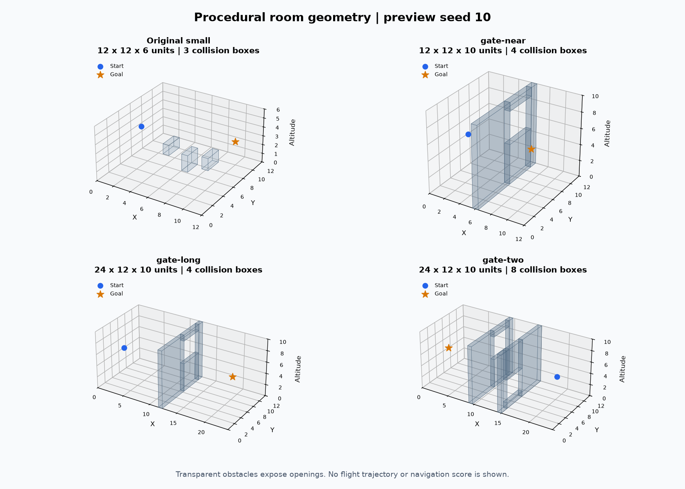
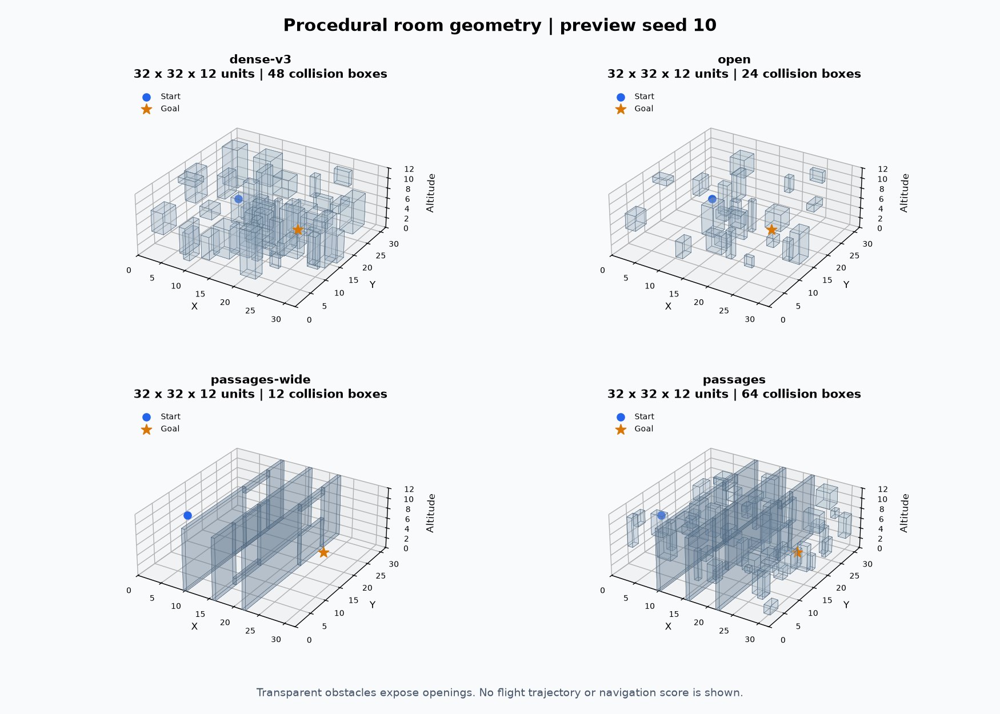
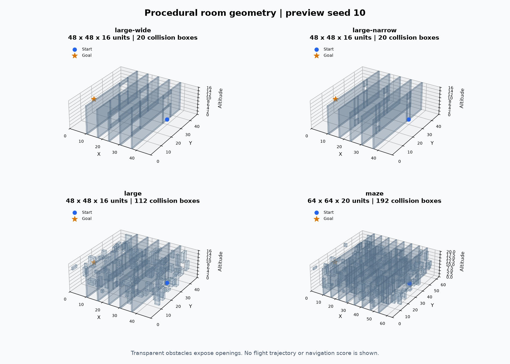
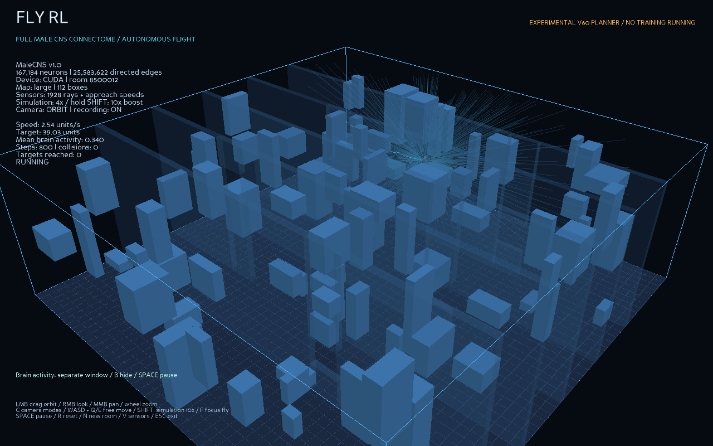
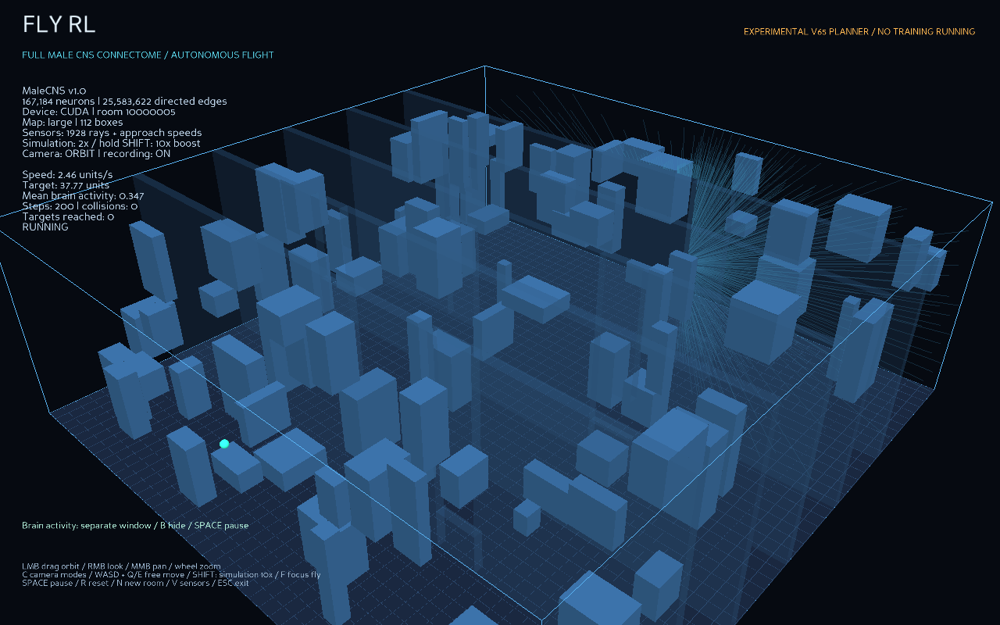
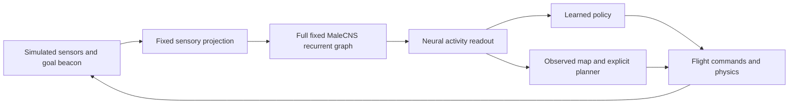
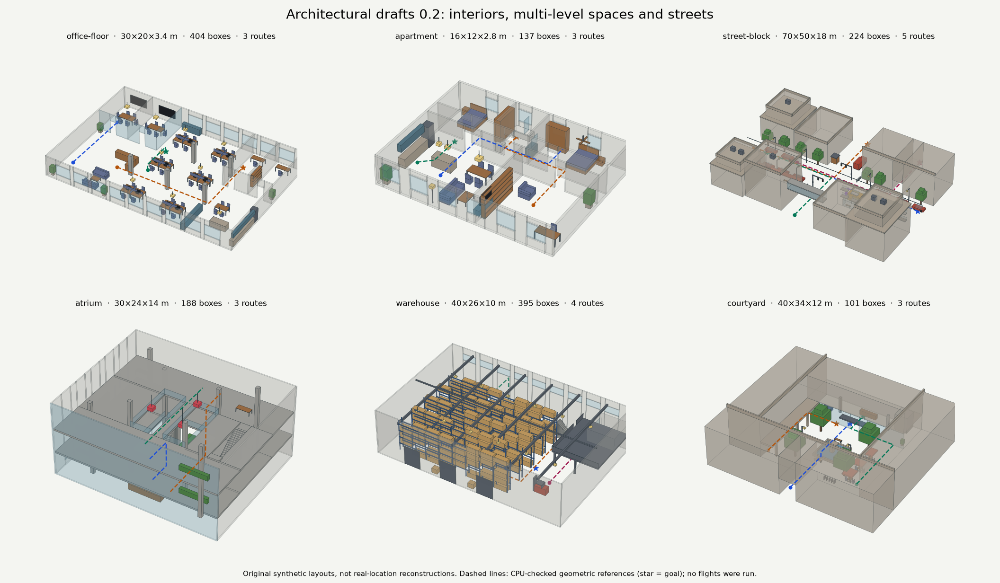

# Fly RL

Fly RL is a **connectome-based 3D navigation project exploring reinforcement learning, imitation learning, and explicit planning**. It places a virtual fruit fly in procedural rooms and uses the full annotated **MaleCNS v1.0 fruit-fly connectome** as a fixed recurrent model that transforms simulated sensor readings into neural activity. Controllers use that activity to choose flight actions, learning from rewards, imitating guided trajectories, or building an observed map and planning a route. The goal is to navigate around obstacles, cross openings, and reach a target in rooms the controller has not seen before.

There are two controller families: learned policies and an explicit observed-map planner. **Learned navigation works well on a single wide opening and moderately well in older dense rooms. The current large-room demo works through explicit planning; a reliable learned policy for those rooms remains unresolved.**

This is an engineered experiment. Sensors, neural equations, sensory projection, and flight dynamics are project choices. It is not a simulation of biological vision, spiking neurons, or wing aerodynamics. Navigation success does not establish an advantage from fly wiring.

[Results](#what-works-today) · [Map gallery](#map-gallery) · [Large-room progression](#large-room-progression) · [Run it](#install-and-run) · [Next steps](#next-steps) · [Documentation](docs/README.md)

Controller revisions now use numbered names: **planner-1.0** is the frozen default, **planner-1.1** adds adaptive clearance, and **planner-1.2** separates mapping from braking ranges. Later revisions remain experimental. [Complete version mapping and compatibility](docs/CONTROLLER_VERSIONS.md) explains intermediate candidates and preserved historical aliases.

## What works today

Maze experiments are closed for this iteration. The latest candidate reaches **7/8 inspected development goals with zero collisions**, preserving earlier successes. The earlier-map regression also passed at 7/8 without collisions; fresh verification is deferred. The candidate is not promoted. [Closing summary and candidate demo command](docs/evidence/maze-wrap-up.md).

These are recorded measurements, current as of October 7, 2026. A **goal** means reaching the target before the deadline without colliding. Collision and timeout are failures.

| Task | Controller and outcome | What the result establishes |
| --- | --- | --- |
| Original small room, 12 x 12 x 6, three obstacles | Early demonstration task; launch and simulation checks are documented | A working environment. No independent small-room success percentage is claimed here |
| Single wide opening, `gate-long`, 24 x 12 x 10 | **Learned baseline: 61/64 goals (95.3%)**, zero collisions, three timeouts; Wilson 95% interval **87.1–98.4%** | Strong performance on this simpler distribution. Selected checkpoint: 114,688 lifetime training transitions. [Evidence](docs/evidence/passage-mastery-v2-results.md) |
| Original medium dense rooms, `dense-v3`, 32 x 32 x 12, 48 obstacles | Separate historical learned-policy experiments: **43/64 (67.2%)**, **50/64 (78.1%)**, **35/64 (54.7%)**, **45/64 (70.3%)**, and **48/64 (75.0%)** | Earlier roughly 70–80% results were real but varied by experiment. Each used its own final pool; these are not a paired ranking. [Counts and uncertainty](docs/RESULTS.md#earlier-dense-room-results) |
| Structured large rooms, `large`, 48 x 48 x 16, 112 boxes and five narrow passages | Initial geometry comparison: **0/64** on its final pool. Best recent learned student v34: **3/8** on reused optimization maps | Learned large-room navigation remains unreliable. The 3/8 is not an independent test or a replacement for the earlier final result |
| The same `large` profile, planner-1.0 | **8/8** reused optimization goals; frozen prospective development: **13/16 (81.25%)**, zero collisions, three timeouts; Wilson 95% interval **57.0–93.4%** | A working autonomous planner demo, not a PPO learning result. The small sample does not establish a guaranteed 80% rate. [Evidence](docs/evidence/observed-map-v55-results.md) |
| The same `large` profile, experimental planner-1.1 | **3/3** corrected known failures; new frozen paired development: **14/16 (87.5%)**, zero collisions, two timeouts; Wilson 95% interval **64.0–96.5%**. planner-1.0 reached 12/16 on these same new rooms | Conditional clearance recovery and higher cruising speed. Two added successes, no lost baseline successes on this suite; not a reserved final result. [Paired evidence](docs/evidence/planner-v60-development-results.md) |
| Experimental distance-stable reader, planner-1.2-exp.1 | Known stationary room corrected; a separate frozen comparison reached **13/16**, two collisions, one timeout, versus **15/16** and one collision for planner-1.1 | The readout fix regressed this fresh development suite and is not selected as the stronger candidate. [Paired outcomes](docs/evidence/planner-v61-development-results.md) |
| Latest measured paired planner-1.2 comparison, the same `large` profile | **15/16 (93.75%)**, zero collisions, one timeout; Wilson 95% interval **71.7–98.9%**. Frozen planner-1.1 had the same paired outcomes | Separate neural ranges for braking preserve mapping context and fix retained false stops/contacts. No measured success-rate advantage over planner-1.1 on this suite. [Evidence](docs/evidence/planner-v65-development-results.md) |
| `large`, experimental planner-1.3-exp.9 | **6/6 retained goals, then 8/8 fresh development goals**, no collisions or timeouts; Wilson 95% interval **67.6–100%** for the fresh eight | Meets its predeclared development rule. Small-sample uncertainty remains; no reserved final assessment or paired superiority claim. [Evidence](docs/MAZE_NAVIGATION.md#verified-large-room-development-checkpoint) |
| `maze`, experimental planner-1.3-exp.11 | **2/2 retained goals**, then **5/8 fresh development goals**, no collisions, three timeouts | Clean occupancy, stalled-reference recovery, and stronger opening-center support. The fresh result misses the declared 7/8 development threshold. These eight rooms then became retained correction data. Later outcomes are reported separately. [Development record](docs/MAZE_NAVIGATION.md) |
| `maze`, candidate planner-1.3-exp.25 | **7/8 retained goals**, then **5/8 fresh development goals (62.5%)**, zero collisions, three fresh timeouts; Wilson 95% interval **30.6–86.3%** | Clearance-aware goal handover fixes a recorded braking deadlock while preserving the preceding six successes. Passed the retained gate but failed the fresh 7/8 criterion; not promoted. No new training or reserved test. [Evidence](docs/MAZE_NAVIGATION.md#clearance-aware-handover-retained-gate-passed) |
| `maze`, October 7 retained corrections | Exp.26: **6/8 goals**; exp.27: **4/8 goals**, both zero collisions | Range extension fixes one failure; progress-only surveying regresses three successes and is rejected. The revisit gate preserves 6/8; coverage-directed exp.29 finished at 6/8; crossing-release exp.30 regressed to 5/8 and was rejected; exp.31 fixed one timeout but regressed another success (6/8); exp.32 passed the retained gate at 7/8 without collisions; earlier-map regressions passed at 7/8 without collisions; further maze experiments are deferred. These are inspected development maps, not new independent results. [Correction history](docs/MAZE_NAVIGATION.md#october-7-opening-range-diagnosis) |
| `open`, `passages`, and intermediate diagnostic profiles | Geometry is implemented; no broad reliable-navigation result is claimed | A generated map or passing geometry test does not mean a controller can navigate it |

**Map structure matters more than size labels.** A long room with one wide gate can be easier than a smaller room with several narrow alternating passages. The gate result does not cover every small map, and the older dense result is not a result for the newer `open` profile.

The early 0/64 final pool has been consumed. Later large-room corrections did not use another reserved final pool. planner-1.0's 16 new development rooms were fixed before its flights, with the controller frozen throughout. Their three failures were inspected afterward and cannot be fresh evidence for a future tuned version. Teacher flights, training practice, optimization maps, prospective development, and final tests remain separate in the [complete results](docs/RESULTS.md).

The October 6 follow-up reached all eight fresh large-room development goals with planner-1.3-exp.9. Maze corrections progressed from two retained timeouts to actual arrivals, then five of eight fresh goals. Those maps became retained correction data. The latest clearance-aware candidate reaches seven of those eight goals, then five of eight new maps without collisions. It missed the fresh gate and is not promoted; the maze demo remains exp.11. [Attempts, recorded trajectories and current evidence](docs/MAZE_NAVIGATION.md).

## Map gallery

These images come from the actual geometry code with preview seed 10. Blue marks the start, amber the goal, and transparent boxes expose openings. **They are room previews, not flown trajectories or performance measurements.** Controller revisions v34 and planner-1.0 use the same `large` geometry; their version numbers do not identify new map types.

### Compact rooms and gate progression



| Configuration | Dimensions | Boxes | Role |
| --- | --- | ---: | --- |
| Original small | 12 x 12 x 6 | 3 | Initial movement demonstration |
| `gate-near` | 12 x 12 x 10 | 4 | One wide opening, nearby goal; curriculum practice |
| `gate-long` | 24 x 12 x 10 | 4 | Longer travel through the same gate; 61/64 learned final result |
| `gate-two` | 24 x 12 x 10 | 8 | Two-opening diagnostic progression; no independent success score |

### Medium rooms and passages



| Configuration | Dimensions | Boxes | Structure |
| --- | --- | ---: | --- |
| `dense-v3` | 32 x 32 x 12 | 48 | Older dense generator; scattered boxes, no compulsory partitions |
| `open` | 32 x 32 x 12 | 24 | New profiled generator with scattered obstacles |
| `passages-wide` | 32 x 32 x 12 | 12 | Three partitions with wide openings, no extra clutter |
| `passages` | 32 x 32 x 12 | 64 | Three partitions with 4 x 4 openings and additional obstacles |

### Large rooms and future difficulty



| Configuration | Dimensions | Boxes | Structure |
| --- | --- | ---: | --- |
| `large-wide` | 48 x 48 x 16 | 20 | Five partitions with wide openings; diagnostic isolation |
| `large-narrow` | 48 x 48 x 16 | 20 | Five 3.2 x 3.2 openings, without extra clutter |
| `large` | 48 x 48 x 16 | 112 | Five narrow alternating openings plus clutter; current demo |
| `maze` | 64 x 64 x 20 | 192 | Eight partitions and four dead-end branches; latest candidate 7/8 retained goals, then 5/8 fresh goals; reliability unresolved |

Profiled maps have a hidden clearance certificate and route-dependent deadline. The controller receives neither the certificate nor the obstacle map. Feasible geometry is not proof of an optimal or dynamically executable flight. See [map generation](docs/GEOMETRY_CURRICULUM.md) and [image provenance](docs/images/README.md).

## Large-room progression

Moving from `dense-v3` to `large` changed the task: five partitions require detours, alternating altitude, and repeated narrow crossings. The fresh comparison restarted learning instead of continuing the earlier successful policy. An unchanged older checkpoint reproduced 3/4 arrivals in retained original rooms but reached 0/4 in large rooms. This shows failed transfer to a harder task, rather than proven loss of the old skill on the same task.

| Stage | Changes and observations | Outcome |
| --- | --- | --- |
| Initial large comparison | Fresh baseline/curriculum runs; progression could advance without passage mastery, and selection retained untrained initialization | **0/64 final goals**. Consuming the training budget did not produce a usable selected policy |
| Learning corrections | Practice gates, temporal features, reward/credit checks, guided supervision, critic isolation, PPO guards | Single-gate learning succeeded separately, but multiple large-room corrections remained at **0/8** development goals. Finite losses and teacher arrivals were insufficient |
| Perception corrections | Full-body panorama, projection readouts, heading equivariance, learned opening references | Better coverage and fitting alone still produced **0/8** in several pilots |
| Learned approach and crossing, v34 | Learn wall orientation, align before the opening, then aim beyond it | **3/8** reused optimization goals, one collision, four timeouts; best learned student in this batch |
| Observed map, v43/v44 | Accumulate observed geometry and estimated motion, then search for routes | **5/8** each, no collisions, three timeouts. Stable motion readout alone did not remove every blockage |
| Current operational solution, planner-1.0 | Escape local safety margins without opening solids; search the exact goal cell; advance past reached route points; brake along the requested 3D direction; retain vertical movement during turns | **8/8 optimization**, then **13/16 frozen prospective development**, no collisions, three timeouts. Explicit planning, not learned movement |

planner-1.0 reconstructs distance, goal, and motion from neural states. It estimates relative pose, builds an occupancy grid, runs bounded weighted search, and converts a nearby route reference into flight commands. It has no learned movement weights and receives no true poses, hidden boxes, seeds, or certified route. It knows the room contract and observes a synthetic goal beacon. All connectome states advance, although the engineered reader cancels recurrence in base channels and retains 5% in panoramic channels.

This is the **current operational solution**, not a definitive solution to learned navigation. Frozen planner-1.0 had three prospective timeouts; route optimality is not guaranteed and biological benefit is untested. The [resolution report](docs/NAVIGATION_RESOLUTION.md) retains the detailed attempts, formulas, budgets, per-room outcomes, and limitations.

The planner-1.1 follow-up resolves those three inspected timeouts and reaches 14/16 on a separate frozen development comparison. Raising speed and relaxing margins indiscriminately caused a regression; planner-1.1 enables broader known-free margin traversal only after a search hits its cap. A distance-readout correction resolved the stationary known flight, but regressed a later paired suite: planner-1.2-exp.1 reached 13/16 versus planner-1.1’s 15/16, with more collisions. Two route/mapping alternatives also failed the retained detour room. These are retained failures, not a completed fix. [Readout diagnosis](docs/evidence/planner-readout-v61-v63.md). planner-1.0 stays the standard launcher's default, while planner-1.1 is available explicitly. [Correction history](docs/evidence/planner-followup-v57-v60.md) and [development protocol](docs/PLANNER_DEVELOPMENT.md) explain the tradeoff and uncertainty.

planner-1.2 now keeps planner-1.1’s contextual mapping input and adds separate clean neural ranges for requested-direction and momentum braking. It resolved the retained stationary flight and four collision/control rooms, then matched planner-1.1 at 15/16 on a fresh paired suite without losing successes. One retained detour room and the new shared timeout remain unresolved. This is a targeted correction with a tied development rate, not proof of a general performance gain or a learned navigation solution. [Complete correction report](docs/evidence/planner-dual-v65-results.md).



This is an actual 800-step rendered verification of planner-1.1, with finite activity and no collisions. It did not complete an episode and is not performance evidence. [Image provenance](docs/images/README.md).



The planner-1.2 image comes from a separate 200-step rendered verification. Activity, controls, and archive integrity passed; it did not complete a navigation episode. Both images use the same original large geometry, rather than new map versions.

## Install and run

Tested on Windows with Conda, Python 3.11, PyTorch 2.7.1+cu128, Stable-Baselines3 2.7.0, Panda3D 1.10.16, and an NVIDIA RTX 3060 with 12 GB VRAM. CUDA is the default; CPU execution is available through the CLI, but full-graph interactive performance there is unestablished. [Tested versions](requirements-lock.txt).

From the repository root, with Conda installed:

```powershell
powershell.exe -NoProfile -ExecutionPolicy Bypass -File .\setup.ps1
.\.conda\python.exe -s -m fly_rl --help
.\launch-observed-map.cmd
```

Setup creates the local `.conda`, installs dependencies, and downloads/prepares the pinned connectome. It requires network access and substantial storage. A fresh clone contains source, public evidence, and images, but no downloaded data, trained checkpoints, or flight archives.

**The observed-map demo requires prepared data but no trained checkpoint.** It computes live sensors, neural activity, and planner actions; it is not a recording of a successful flight. The room and brain open in separate windows. Optional arguments:

```powershell
.\launch-observed-map.cmd --speed 4 --seed 370001
.\launch-observed-map.cmd --record-brain
.\launch-observed-map.cmd --controller-version 1.2 --seed 10000005
```

To see an untrained policy interface instead:

```powershell
.\.conda\python.exe -s -m fly_rl demo --map-profile large --dynamics coordinated --brain-view
```

Older `launch-dense.cmd`, `launch-flight.cmd`, and `launch-demo.cmd` support local historical models. Those trained weights are not shipped here. The dense launcher reports a missing-model error when no candidate exists. `.cmd` wrappers explicitly invoke PowerShell to avoid `.ps1` associations opening an editor. [Commands](docs/COMMANDS.md) covers other modes and checkpoint loading.

Viewing never starts training or modifies weights. Checkpoint loading runs live inference; replay restores saved states without executing a brain. Sensor, dynamics, and readout contracts prevent silent reinterpretation. Explicit transfer does not establish performance in a new task.

| Control | Action |
| --- | --- |
| Space | Pause/resume |
| Shift | Request ten times the simulation rate while held |
| R / N | Reset this room / generate the next room |
| C / F | Cycle orbit, chase, and free cameras / focus on the fly |
| Mouse drag / wheel | Rotate, pan, look, or zoom |
| WASD and Q/E | Move the free camera, including altitude |
| V | Toggle sensor rays |
| B | Open or restore the brain window |
| Escape | Exit and finalize recording |

Shift changes simulation speed, not physical acceleration or maximum flight speed. Compute and rendering limit achieved acceleration; physics keeps its 0.05-second timestep. Neural colors show modeled activity, not experimental firing or a causal explanation of movement. The planner supplies no PPO action gradient. See [flight and neuron inspection](docs/FLIGHT_AND_NEURONS.md).

## How the experiment is organized



The graph contains **167,184 neurons**, **25,583,622 directed edges**, and **124,176,995 represented synapses** after the documented annotation filter. PPO optimizes the actor and critic, not connectome synapses. The anatomical view uses 140,033 supplied soma positions; the remaining 27,151 neurons compute but lack supplied coordinates. [Data and model](docs/DATA_AND_MODEL.md), [architecture](docs/ARCHITECTURE.md), and [mathematics](docs/MATHEMATICS.md) explain assumptions and optimization equations.

Training fits parameters. Practice can control curriculum progression. Validation selects candidates. Optimization maps guide design changes. Prospective development measures a frozen version on new maps. A reserved final test follows selection and is then consumed. These are not combined into one success curve. Tests, finite losses, reload compatibility, and teacher arrivals do not substitute for autonomous results.

Each demo retains a unique archive in `runs/demo/`, with metadata, states, actions, and integrity checks. Latest previews and `reports/demo.json` may be overwritten; historical session directories are not. `--record-brain` adds full-neuron snapshots, which cannot be reconstructed from pooled features. Planner sessions archive controller code and specification rather than a fictitious PPO checkpoint. [Operations](docs/OPERATIONS.md) explains storage, replay, recovery, and backups.

## Next steps

1. **Finish maze verification and inspect the selected demo.** The large-room correction has passed its retained and fresh development checks. The latest maze candidate reaches 7/8 retained goals; its unchanged fresh suite finished at 5/8 and failed the gate. Diagnose the remaining cases before another declared check; inspect rendering and controls before changing the maze launcher's default.
2. **Diagnose remaining maze search failures.** Use completed trajectories and observed maps to separate opening discovery, reference execution and goal handover. Preserve measured controllers, require retained success before a new suite, and treat inspected fresh failures as future correction data.
3. **Teach a student complete navigation.** Collect planner demonstrations under an explicit budget and include student-state recovery. Separate teacher arrivals from teacher-free student arrivals; preserve simpler-task references.
4. **Increase difficulty through verified stages.** Separate extra walls, narrow openings, altitude changes and clutter before combining them. Verify each room/sensor contract and require measured navigation before adding noise, wind or moving obstacles.
5. **Measure the connectome's contribution.** Compare real wiring, altered/disconnected recurrence and a conventional controller with matched sensors, budgets, seeds and selection. Extend neural replay and exact resumption alongside this work.
6. **Move to simulations of real places after the maze experiment.** Start with static interiors reconstructed from real buildings, then outdoor streets and connected indoor/outdoor routes. Import licensed 3D geometry, verify scale and collision meshes, and keep complete buildings or neighborhoods separate between development and final evaluation. Begin with the existing sensor interface; introduce cameras, noise, wind and moving people or vehicles in separate experiments. These are simulated flights, not physical deployment.

Maze correction work resumed on October 7. The range-only candidate reached 6/8 goals on the inspected eight-map suite with no collisions; the progress-only wall scan regressed to 4/8 and was rejected; the revisit gate preserved 6/8; coverage-directed recovery finished at 6/8; bounded crossing release regressed to 5/8 and was rejected; observed consensus reached 6/8 with a regression; terminal-distance gating passed the retained gate at 7/8 without collisions; earlier-map regressions passed at 7/8 without collisions; further maze experiments are deferred. No new training or reserved-test evaluation has started. The [roadmap](ROADMAP.md) defines order and acceptance criteria. Reliable learned large-room navigation and the independent 80% target remain open.

### Architectural scene preparation

CPU-only preparation has started for the next environment stage. Revision 0.2 has six scenes: an office floor, an apartment, a street block, a three-storey atrium, a high-bay warehouse and a courtyard with an enterable lobby. Together they contain 21 tagged navigation situations. They include portable 3D meshes, collision boxes (glass, stairs, overhangs and multi-level floors), CPU-checked geometric references, floor plans and an offline interactive preview with a cutaway slider. These are original architectural designs, not scans of real places; no controller has flown them yet. [Inspect the scenes and integration limits](docs/ARCHITECTURAL_SCENES.md).



## Repository map

```text
fly_rl/connectome/    Data preparation, audits, fixed brain, anatomy, readouts
fly_rl/simulation/    Sensors, rooms, collision, and flight dynamics
fly_rl/navigation/   Observed-map planner and stateful controller
fly_rl/training/     Policies, PPO, supervision, curriculum, selection, evaluation
fly_rl/visualization/ Live windows, cameras, neural inspection, and plots
fly_rl/recordings/    Telemetry, integrity checks, recovery, and replay
tests/               Checks grouped by responsibility
scripts/             Repository/publication checks and map-image generation
docs/                Guides, formulas, protocols, and measured results
docs/images/         Public geometry previews and provenance
private/             Detailed local journals and machine evidence; ignored
data/                Downloaded/prepared data; ignored
runs/                Checkpoints, experiments, recordings; ignored
reports/             Generated QA and analysis output; ignored
.conda/              Local dependencies; ignored
```

The public tree contains aggregate evidence rather than machine logs or model binaries. Back up ignored artifacts independently. [Contributing](CONTRIBUTING.md) covers code boundaries and checks; [public release preparation](docs/PUBLICATION.md) covers export, history separation, and licensing.

## Credits and licenses

Original project code and documentation use the [MIT license](LICENSE). MaleCNS data retains its separate **CC BY 4.0** license; MIT does not relicense the dataset or dependencies. Preserve original attribution and identify transformations when sharing derived data.

The MaleCNS reconstruction, annotations, and soma coordinates were produced by the FlyEM team at HHMI Janelia Research Campus, the University of Cambridge Department of Zoology, the MRC Laboratory of Molecular Biology, Google Research, and contributors credited in the [official project](https://male-cns.janelia.org/).

Cite Berg, S., Beckett, I. R., Costa, M., et al. (2026), *Sexual dimorphism in the complete Drosophila male central nervous system connectome*, Cell, 189(18), 5504–5526.e15. [DOI](https://doi.org/10.1016/j.cell.2026.08.015). The source license is linked on the [official download page](https://male-cns.janelia.org/download/).

Fly RL filters and transforms those tables; the original researchers did not produce this controller or its results. [Credits and references](docs/REFERENCES.md) describes modifications and reusable citations. Use the [documentation index](docs/README.md) for the remaining guides.


### Large and maze development demos

```powershell
.\launch-large.cmd
.\launch-maze.cmd
```

The large launcher selects frozen planner-1.3-exp.9, verified on six retained and eight fresh large rooms. The maze launcher selects planner-1.3-exp.11, which reaches both retained maze goals; its completed fresh development check reached 5/8 and missed its threshold; the latest successor reached 7/8 retained goals but 5/8 fresh goals and was not promoted. Both execute autonomous flight live, show neural activity in a separate brain window, and save telemetry. They do not train or replay a saved flight. Use `--speed 4` to speed up simulated time; hold Shift for the existing 10x boost. Seeds can be changed with `--seed`.

### Architectural runtime status

The revised six-scene collection now has public simulation and full-connectome environment adapters. A 48-transition CUDA smoke passed across all six scenes; 49 focused tests passed. These short flights do not establish target arrival. Launch the live viewer with `.\launch-architecture.cmd`; N changes situation and G changes scene. The separate brain window, controls and short flight recording were verified. The initial original-objective check completed at **18/21 goals, zero collisions and three timeouts**, with all cases measured. It used 11,829 full-connectome physical transitions, no training and no reserved test. Protected aliases and frozen sources matched. These inspected synthetic scenes are development evidence, not independent real-world generalization. [Complete results](docs/evidence/architectural-initial-navigation-results.md). [Launcher and controls](docs/ARCHITECTURAL_SCENES.md#interactive-architectural-demo). [Evidence and limitations](docs/evidence/architectural-fullgraph-integration.md).
