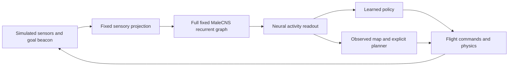

# Fly RL

A virtual fruit fly explores procedural 3D rooms using activity from the full annotated **MaleCNS v1.0 fruit-fly connectome**. The experiment asks whether a controller can turn that activity into useful navigation: avoid obstacles, cross openings, and reach a goal in rooms it has not seen.

There are two controller families: learned policies and an explicit observed-map planner. **Learned navigation works well on a single wide opening and moderately well in older dense rooms. The current large-room demo works through explicit planning; a reliable learned policy for those rooms remains unresolved.**

This is an engineered experiment. Sensors, neural equations, sensory projection, and flight dynamics are project choices. It is not a simulation of biological vision, spiking neurons, or wing aerodynamics. Navigation success does not establish an advantage from fly wiring.

[Results](#what-works-today) · [Map gallery](#map-gallery) · [Large-room progression](#large-room-progression) · [Run it](#install-and-run) · [Next steps](#next-steps) · [Documentation](docs/README.md)

## What works today

These are recorded measurements, current as of October 5, 2026. A **goal** means reaching the target before the deadline without colliding. Collision and timeout are failures.

| Task | Controller and outcome | What the result establishes |
| --- | --- | --- |
| Original small room, 12 x 12 x 6, three obstacles | Early demonstration task; launch and simulation checks are documented | A working environment. No independent small-room success percentage is claimed here |
| Single wide opening, `gate-long`, 24 x 12 x 10 | **Learned baseline: 61/64 goals (95.3%)**, zero collisions, three timeouts; Wilson 95% interval **87.1–98.4%** | Strong performance on this simpler distribution. Selected checkpoint: 114,688 lifetime training transitions. [Evidence](docs/evidence/passage-mastery-v2-results.md) |
| Original medium dense rooms, `dense-v3`, 32 x 32 x 12, 48 obstacles | Separate historical learned-policy experiments: **43/64 (67.2%)**, **50/64 (78.1%)**, **35/64 (54.7%)**, **45/64 (70.3%)**, and **48/64 (75.0%)** | Earlier roughly 70–80% results were real but varied by experiment. Each used its own final pool; these are not a paired ranking. [Counts and uncertainty](docs/RESULTS.md#earlier-dense-room-results) |
| Structured large rooms, `large`, 48 x 48 x 16, 112 boxes and five narrow passages | Initial geometry comparison: **0/64** on its final pool. Best recent learned student v34: **3/8** on reused optimization maps | Learned large-room navigation remains unreliable. The 3/8 is not an independent test or a replacement for the earlier final result |
| The same `large` profile, planner v55 | **8/8** reused optimization goals; frozen prospective development: **13/16 (81.25%)**, zero collisions, three timeouts; Wilson 95% interval **57.0–93.4%** | A working autonomous planner demo, not a PPO learning result. The small sample does not establish a guaranteed 80% rate. [Evidence](docs/evidence/observed-map-v55-results.md) |
| `open`, `passages`, intermediate diagnostic profiles, and `maze` | Geometry is implemented; no broad reliable-navigation result is claimed | A generated map or passing geometry test does not mean a controller can navigate it |

**Map structure matters more than size labels.** A long room with one wide gate can be easier than a smaller room with several narrow alternating passages. The gate result does not cover every small map, and the older dense result is not a result for the newer `open` profile.

The early 0/64 final pool has been consumed. Later large-room corrections did not use another reserved final pool. V55's 16 new development rooms were fixed before its flights, with the controller frozen throughout. Their three failures were inspected afterward and cannot be fresh evidence for a future tuned version. Teacher flights, training practice, optimization maps, prospective development, and final tests remain separate in the [complete results](docs/RESULTS.md).

## Map gallery

These images come from the actual geometry code with preview seed 10. Blue marks the start, amber the goal, and transparent boxes expose openings. **They are room previews, not flown trajectories or performance measurements.** Controller revisions v34 and v55 use the same `large` geometry; their version numbers do not identify new map types.

### Compact rooms and gate progression


| Configuration | Dimensions | Boxes | Role |
| --- | --- | ---: | --- |
| Original small | 12 x 12 x 6 | 3 | Initial movement demonstration |
| `gate-near` | 12 x 12 x 10 | 4 | One wide opening, nearby goal; curriculum practice |
| `gate-long` | 24 x 12 x 10 | 4 | Longer travel through the same gate; 61/64 learned final result |
| `gate-two` | 24 x 12 x 10 | 8 | Two-opening diagnostic progression; no independent success score |

### Medium rooms and passages


| Configuration | Dimensions | Boxes | Structure |
| --- | --- | ---: | --- |
| `dense-v3` | 32 x 32 x 12 | 48 | Older dense generator; scattered boxes, no compulsory partitions |
| `open` | 32 x 32 x 12 | 24 | New profiled generator with scattered obstacles |
| `passages-wide` | 32 x 32 x 12 | 12 | Three partitions with wide openings, no extra clutter |
| `passages` | 32 x 32 x 12 | 64 | Three partitions with 4 x 4 openings and additional obstacles |

### Large rooms and future difficulty


| Configuration | Dimensions | Boxes | Structure |
| --- | --- | ---: | --- |
| `large-wide` | 48 x 48 x 16 | 20 | Five partitions with wide openings; diagnostic isolation |
| `large-narrow` | 48 x 48 x 16 | 20 | Five 3.2 x 3.2 openings, without extra clutter |
| `large` | 48 x 48 x 16 | 112 | Five narrow alternating openings plus clutter; current demo |
| `maze` | 64 x 64 x 20 | 192 | Eight partitions and four dead-end branches; navigation unverified |

Profiled maps have a hidden clearance certificate and route-dependent deadline. The controller receives neither the certificate nor the obstacle map. Feasible geometry is not proof of an optimal or dynamically executable flight. See [map generation](docs/GEOMETRY_CURRICULUM.md) and [image provenance](docs/images/README.md).

## Large-room progression

Moving from `dense-v3` to `large` changed the task: five partitions require detours, alternating altitude, and repeated narrow crossings. The fresh comparison restarted learning instead of continuing the earlier successful policy. An unchanged older checkpoint reproduced 3/4 arrivals in retained original rooms but reached 0/4 in large rooms. This shows failed transfer to a harder task, rather than proven loss of the old skill on the same task.

| Stage | Changes and observations | Outcome |
| --- | --- | --- |
| Initial large comparison | Fresh baseline/curriculum runs; progression could advance without passage mastery, and selection retained untrained initialization | **0/64 final goals**. Consuming the training budget did not produce a usable selected policy |
| Learning corrections | Practice gates, temporal features, reward/credit checks, guided supervision, critic isolation, PPO guards | Single-gate learning succeeded separately, but multiple large-room corrections remained at **0/8** development goals. Finite losses and teacher arrivals were insufficient |
| Perception corrections | Full-body panorama, projection readouts, heading equivariance, learned opening references | Better coverage and fitting alone still produced **0/8** in several pilots |
| Learned approach and crossing, v34 | Learn wall orientation, align before the opening, then aim beyond it | **3/8** reused optimization goals, one collision, four timeouts; best learned student in this batch |
| Observed map, v43/v44 | Accumulate observed geometry and estimated motion, then search for routes | **5/8** each, no collisions, three timeouts. Stable motion readout alone did not remove every blockage |
| Current operational solution, v55 | Escape local safety margins without opening solids; search the exact goal cell; advance past reached route points; brake along the requested 3D direction; retain vertical movement during turns | **8/8 optimization**, then **13/16 frozen prospective development**, no collisions, three timeouts. Explicit planning, not learned movement |

V55 reconstructs distance, goal, and motion from neural states. It estimates relative pose, builds an occupancy grid, runs bounded weighted search, and converts a nearby route reference into flight commands. It has no learned movement weights and receives no true poses, hidden boxes, seeds, or certified route. It knows the room contract and observes a synthetic goal beacon. All connectome states advance, although the engineered reader cancels recurrence in base channels and retains 5% in panoramic channels.

This is the **current operational solution**, not a definitive solution to learned navigation. Three prospective timeouts remain, route optimality is not guaranteed, and biological benefit is untested. The [resolution report](docs/NAVIGATION_RESOLUTION.md) retains twenty detailed sections covering attempts, formulas, budgets, per-room outcomes, and limitations.

## Install and run

Tested on Windows with Conda, Python 3.11, PyTorch 2.7.1+cu128, Stable-Baselines3 2.7.0, Panda3D 1.10.16, and an NVIDIA RTX 3060 with 12 GB VRAM. CUDA is the default; CPU execution is available through the CLI, but full-graph interactive performance there is unestablished. [Tested versions](requirements-lock.txt).

From the repository root, with Conda installed:

```powershell
powershell.exe -NoProfile -ExecutionPolicy Bypass -File .\setup.ps1
.\.conda\python.exe -s -m fly_rl --help
.\launch-observed-map.cmd
```

Setup creates the local `.conda`, installs dependencies, and downloads/prepares the pinned connectome. It requires network access and substantial storage. A fresh clone contains source, public evidence, and images, but no downloaded data, trained checkpoints, or flight archives.

**The observed-map demo requires prepared data but no trained checkpoint.** It computes live sensors, neural activity, and planner actions; it is not a recording of a successful flight. The room and brain open in separate windows. Optional arguments:

```powershell
.\launch-observed-map.cmd --speed 4 --seed 370001
.\launch-observed-map.cmd --record-brain
```

To see an untrained policy interface instead:

```powershell
.\.conda\python.exe -s -m fly_rl demo --map-profile large --dynamics coordinated --brain-view
```

Older `launch-dense.cmd`, `launch-flight.cmd`, and `launch-demo.cmd` support local historical models. Those trained weights are not shipped here. The dense launcher reports a missing-model error when no candidate exists. `.cmd` wrappers explicitly invoke PowerShell to avoid `.ps1` associations opening an editor. [Commands](docs/COMMANDS.md) covers other modes and checkpoint loading.

Viewing never starts training or modifies weights. Checkpoint loading runs live inference; replay restores saved states without executing a brain. Sensor, dynamics, and readout contracts prevent silent reinterpretation. Explicit transfer does not establish performance in a new task.

| Control | Action |
| --- | --- |
| Space | Pause/resume |
| Shift | Request ten times the simulation rate while held |
| R / N | Reset this room / generate the next room |
| C / F | Cycle orbit, chase, and free cameras / focus on the fly |
| Mouse drag / wheel | Rotate, pan, look, or zoom |
| WASD and Q/E | Move the free camera, including altitude |
| V | Toggle sensor rays |
| B | Open or restore the brain window |
| Escape | Exit and finalize recording |

Shift changes simulation speed, not physical acceleration or maximum flight speed. Compute and rendering limit achieved acceleration; physics keeps its 0.05-second timestep. Neural colors show modeled activity, not experimental firing or a causal explanation of movement. The planner supplies no PPO action gradient. See [flight and neuron inspection](docs/FLIGHT_AND_NEURONS.md).

## How the experiment is organized



The graph contains **167,184 neurons**, **25,583,622 directed edges**, and **124,176,995 represented synapses** after the documented annotation filter. PPO optimizes the actor and critic, not connectome synapses. The anatomical view uses 140,033 supplied soma positions; the remaining 27,151 neurons compute but lack supplied coordinates. [Data and model](docs/DATA_AND_MODEL.md), [architecture](docs/ARCHITECTURE.md), and [mathematics](docs/MATHEMATICS.md) explain assumptions and optimization equations.

Training fits parameters. Practice can control curriculum progression. Validation selects candidates. Optimization maps guide design changes. Prospective development measures a frozen version on new maps. A reserved final test follows selection and is then consumed. These are not combined into one success curve. Tests, finite losses, reload compatibility, and teacher arrivals do not substitute for autonomous results.

Each demo retains a unique archive in `runs/demo/`, with metadata, states, actions, and integrity checks. Latest previews and `reports/demo.json` may be overwritten; historical session directories are not. `--record-brain` adds full-neuron snapshots, which cannot be reconstructed from pooled features. Planner sessions archive controller code and specification rather than a fictitious PPO checkpoint. [Operations](docs/OPERATIONS.md) explains storage, replay, recovery, and backups.

## Next steps

1. **Resolve the three v55 timeouts.** Diagnose search limits, route changes, detours, and odometry from existing traces. Preserve frozen v55 and test individual interventions before combining them.
2. **Measure a corrected planner on fresh rooms.** Declare selection rules and suites, freeze the candidate, and report goals, collisions, timeouts, confidence intervals, route length, flight time, and compute. Inspected failures become development cases.
3. **Teach a student complete navigation.** Collect planner demonstrations under an explicit budget and include student-state recovery. Separate teacher arrivals from teacher-free student arrivals; preserve simpler-task references.
4. **Increase difficulty through verified stages.** Separate extra walls, narrow openings, altitude changes, and clutter before combining them. Advance through two-gate, passage, and large tasks only after measured mastery. Check size/sensor contracts before `maze`.
5. **Measure the connectome's contribution.** Compare real wiring, altered/disconnected recurrence, and a conventional controller with matched sensors, budgets, seeds, and selection. Extend neural replay and exact resumption alongside this work.

These are proposed experiments, not ongoing runs. The [roadmap](ROADMAP.md) defines order and acceptance criteria. Reliable learned large-room navigation and the independent 80% target remain open.

## Repository map

```text
fly_rl/connectome/    Data preparation, audits, fixed brain, anatomy, readouts
fly_rl/simulation/    Sensors, rooms, collision, and flight dynamics
fly_rl/navigation/   Observed-map planner and stateful controller
fly_rl/training/     Policies, PPO, supervision, curriculum, selection, evaluation
fly_rl/visualization/ Live windows, cameras, neural inspection, and plots
fly_rl/recordings/    Telemetry, integrity checks, recovery, and replay
tests/               Checks grouped by responsibility
scripts/             Repository/publication checks and map-image generation
docs/                Guides, formulas, protocols, and measured results
docs/images/         Public geometry previews and provenance
private/             Detailed local journals and machine evidence; ignored
data/                Downloaded/prepared data; ignored
runs/                Checkpoints, experiments, recordings; ignored
reports/             Generated QA and analysis output; ignored
.conda/              Local dependencies; ignored
```

The public tree contains aggregate evidence rather than machine logs or model binaries. Back up ignored artifacts independently. [Contributing](CONTRIBUTING.md) covers code boundaries and checks; [public release preparation](docs/PUBLICATION.md) covers export, history separation, and licensing.

## Credits and licenses

Original project code and documentation use the [MIT license](LICENSE). MaleCNS data retains its separate **CC BY 4.0** license; MIT does not relicense the dataset or dependencies. Preserve original attribution and identify transformations when sharing derived data.

The MaleCNS reconstruction, annotations, and soma coordinates were produced by the FlyEM team at HHMI Janelia Research Campus, the University of Cambridge Department of Zoology, the MRC Laboratory of Molecular Biology, Google Research, and contributors credited in the [official project](https://male-cns.janelia.org/).

Cite Berg, S., Beckett, I. R., Costa, M., et al. (2026), *Sexual dimorphism in the complete Drosophila male central nervous system connectome*, Cell, 189(18), 5504–5526.e15. [DOI](https://doi.org/10.1016/j.cell.2026.08.015). The source license is linked on the [official download page](https://male-cns.janelia.org/download/).

Fly RL filters and transforms those tables; the original researchers did not produce this controller or its results. [Credits and references](docs/REFERENCES.md) describes modifications and reusable citations. Use the [documentation index](docs/README.md) for the remaining guides.
