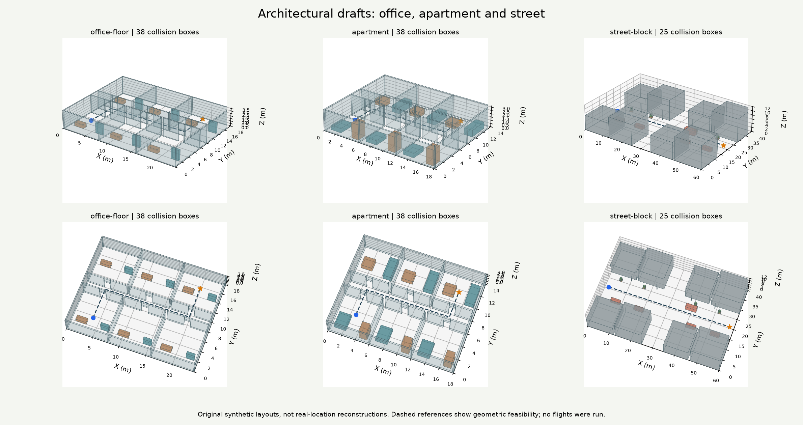

# Architectural scene drafts

This CPU-only preparation runs alongside the paused maze work. It creates original 3D layouts inspired by building interiors and streets, portable meshes, collision records, and inspection previews. It does not load the connectome, train a policy, or run a navigation experiment. These scenes are not reconstructions of specific real places and do not yet have measured fly results.

## First asset revision

`architecture-0.1` identifies the asset schema and initial design revision, independently of planner versions. The checked-in collection is in [assets/architecture/draft-0.1](../assets/architecture/draft-0.1/README.md).

| Scene | Dimensions, meters | Collision boxes | Situations |
| --- | --- | --- | --- |
| Office floor | 24 x 18 x 3.6 | 38 | Furnished room to room; corridor to office |
| Apartment | 18 x 14 x 3.2 | 38 | Bedroom to living room; low-to-high altitude transition |
| Street block | 60 x 40 x 12 | 25 | Street traverse; intersection turn; clearance above a parked delivery van |

The office has six rooms, a 2.2 m corridor and 1.2 m doorways. The apartment uses 0.9 m doors with 2.1 m lintels. Both have furniture at different heights. The street includes eight solid building envelopes, a perpendicular intersection, parked cars, a delivery van, planters, vegetation proxies and light poles. Buildings on the street have no enterable interiors in this revision. Pedestrians, moving vehicles and wind are not simulated.



## Inspect and regenerate

Open [the self-contained preview](../assets/architecture/draft-0.1/index.html) in a local browser. Choose a scene and situation, drag to orbit, Shift-drag or right-drag to pan, and use the wheel to zoom. Top view exposes the layout. Reference lines can be hidden. The preview uses Canvas2D projections, needs no external libraries or server, and performs no neural computation. A browser may use its own graphics acceleration; the asset-building pipeline needs no CUDA or GPU compute.

From the repository root:

```powershell
.\.conda\python.exe -s scripts/build_architectural_scenes.py
```

This replaces the named draft assets and previews in `assets/architecture/draft-0.1`. Use `--output reports/architecture-preview` for a separate local build. Generation is deterministic for the scene JSON and mesh geometry. PNG bytes can depend on Matplotlib and font versions; the manifest records the actual output hashes.

## Files and coordinate contract

Each scene has a Wavefront OBJ mesh, MTL colors and JSON collision/scenario record. All dimensions are meters. X points east, Y north and Z up; the origin is the southwest ground corner. Every collision solid is an axis-aligned closed box with a stable name and material. Doorways contain real gaps plus solid lintels. Mesh faces have outward winding. Ground is a visual-only OBJ plane; a flight environment must enforce ground and ceiling bounds separately. Interior ceilings are intentionally omitted from the inspection mesh so rooms remain visible.

The JSON is the authoritative collision representation. Do not infer physics from transparent preview colors. Furniture and vehicles are solid box proxies, not detailed surface models. Each situation includes a start, goal and a reference polyline. That reference is privileged asset-validation metadata: it must not enter an autonomous controller's observations or action selection.

The [manifest](../assets/architecture/draft-0.1/manifest.json) records geometry fingerprints, file SHA-256 hashes, body radius, clearance and reference lengths. The scene fingerprint covers dimensions, solids, situations, descriptions and provenance, excluding its own validation report. Hashing detects changes; it does not prove safe navigation.

## Verification and limits

All seven reference polylines pass exact segment-versus-box checks with boxes expanded by the existing 0.16 m fly body radius plus 0.20 m extra clearance. Routes also remain inside those expanded scene bounds. This proves static geometric feasibility under conservative box expansion. It does not prove that the fly can execute the turns with its acceleration, inertia, sensors or current controller, and it is not independent generalization evidence.

Eight focused tests passed: reference clearance and deterministic fingerprints for all three scenes; doorway/lintel ray geometry; rejection of blocked and out-of-bounds routes; mesh index and outward-face integrity; and self-contained preview construction. Together with the existing map-profile regression tests, 25 tests passed. Node's syntax check passed for the generated preview script. The static gallery was visually inspected. Interactive browser QA could not be completed because the available browser tool blocks local `file:` URLs; no alternative browser route was used. Orbit, pan and scene-selection behavior remain to be checked interactively by the user or in an authorized browser setup.

No current `FlightWorld` profile, launcher, frozen controller, checkpoint or benchmark pool was changed. Importing these assets into a future environment still requires an explicit scene adapter, reset and recording contracts, sensor checks, declared physical deadlines and dynamic flight verification. An OBJ that opens in a modeling application is not yet a supported benchmark.

## From drafts to actual places

Next prepare a licensed source collection for real building interiors and street reconstructions. Record the original publisher, source URL, license, conversion steps and source hashes before importing. Avoid claiming an invented layout depicts an actual building. Check units and axes, mesh holes, collision simplification, opening widths and valid start/goal pairs before any flights.

Add architectural variety next: asymmetric offices, homes with different room adjacency, an atrium with connected floors, a courtyard, and streets with bends and partial occlusion. Keep decorative geometry separate from physics, and retain inspectable collision proxies. Dynamic scenarios need time-dependent collision and sensor semantics, rather than labels attached to stationary boxes.

Once maze verification is complete, declare experiments for geometry transfer with the current range/beacon interface first. Camera perception and replacement of the goal beacon are separate tasks. Split by entire building or neighborhood, not only by route. These public, inspected draft assets are development material and can never be an untouched test set. See the [roadmap](../ROADMAP.md#future-stage-navigate-simulations-of-real-places) for the experimental sequence.
