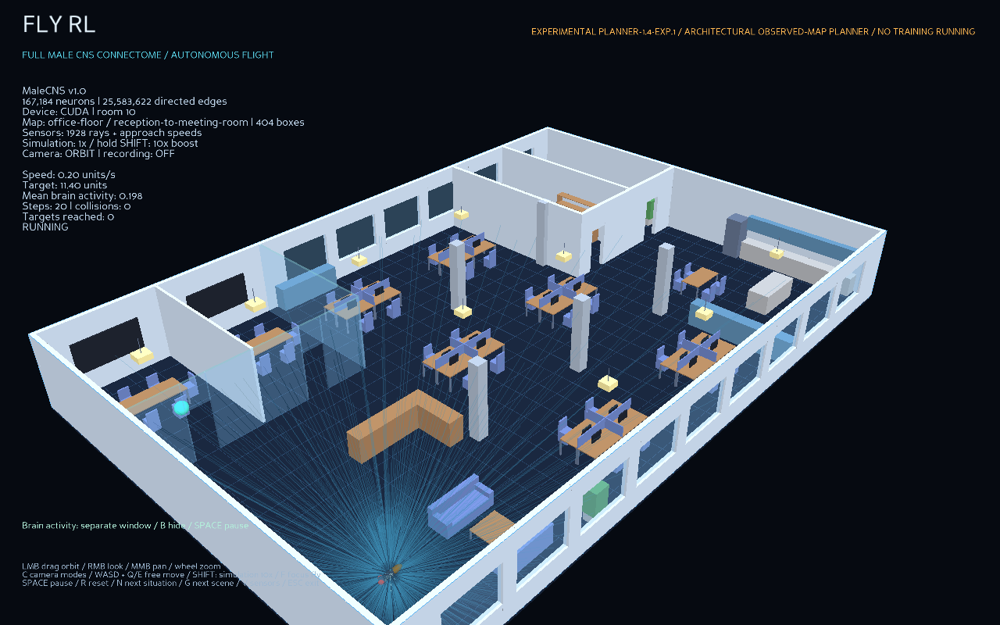
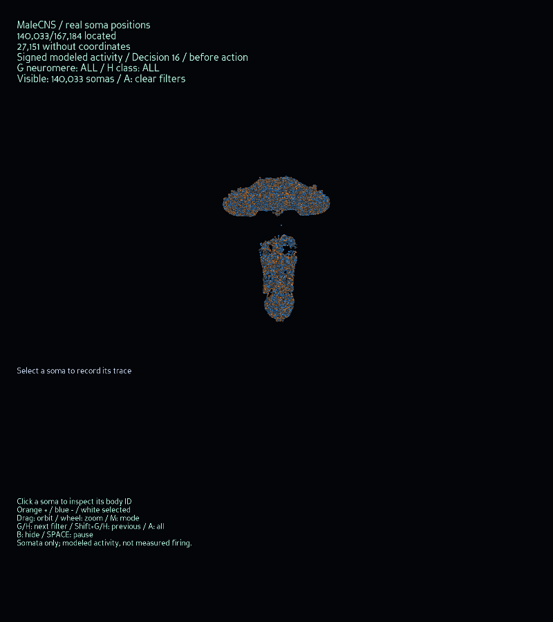

# Architectural scene drafts

This CPU-only preparation runs alongside the resumed maze correction work. It creates original 3D layouts inspired by building interiors and streets, portable meshes, collision records, and inspection previews. It does not load the connectome, train a policy, or run a navigation experiment. These scenes are not reconstructions of specific real places and do not yet have measured fly results.

## Revision 0.2

`architecture-0.2` replaces the three box-room drafts of 0.1 (still in git history) with more detailed redesigns and adds three scene types. The checked-in collection is in [assets/architecture/draft-0.2](../assets/architecture/draft-0.2/README.md).

| Scene | Kind | Dimensions, m | Collision boxes | Situations |
| --- | --- | --- | --- | --- |
| Office floor | interior | 30 x 20 x 3.4 | 404 | Reception to a glass meeting room; open plan to a private office; over a desk cluster |
| Apartment | interior | 16 x 12 x 2.8 | 137 | Sofa to bedroom; study to bathroom; low-to-high over the kitchen island |
| Street block | outdoor | 70 x 50 x 18 | 224 | Street traverse; intersection turn; under a skybridge; through a covered passage; over a parked bus |
| Atrium | interior | 30 x 24 x 14 | 188 | Lobby to first gallery; void climb to top gallery; bridge crossing |
| Warehouse | interior | 40 x 26 x 10 | 395 | Aisle run; aisle switch; over the racks; under the mezzanine and up |
| Courtyard | mixed | 40 x 34 x 12 | 101 | Gate over the fountain; arcade walk; courtyard into a lobby |

What changed from 0.1:

- **Furniture and fittings are built from parts.** Tables have tops and legs, so there is open space underneath. Chairs, sofas and beds have backs, arms and headboards. Shelves are open frames. Lamps hang on cords from the ceiling, and a ceiling fan has blades. These parts create overhead obstacles and thin features that a range sensor must resolve.
- **Glass.** Exterior windows are real openings filled with thin glass panes. Meeting rooms, railings, a shower screen and a skybridge are glass. Glass is solid for collision; its translucency is only a rendering choice.
- **Multi-level space.** The atrium has three floors with slabs, glass balustrades, a solid stair inside the void, a second stair through a slab opening, a bridge across the void and a hanging sculpture. The warehouse has a mezzanine with an office, a railing and a stair.
- **Streets with depth.** Buildings have set-back upper storeys, cornices, parapets, rooftop plant, balconies and shop awnings. The street adds a 4 m covered passage, a skybridge, a bus shelter, traffic signals with mast arms, lamp posts with arms, an overhead tram wire, trees with crowns, bollards, a kiosk, cars with cabins and wheels, a bus and a van.
- **Indoor/outdoor connection.** The courtyard joins a gate passage, an arcade and a glass-fronted lobby that the fly can enter.
- **Route metadata.** Each situation carries tags (for example `doorway`, `overhang`, `multi-level`, `narrow-aisle`). The validation report records route length, altitude range and the tightest sampled clearance.

## Inspect and regenerate

Open [the self-contained preview](../assets/architecture/draft-0.2/index.html) in a local browser. Choose a scene and situation, drag to orbit, Shift-drag or right-drag to pan, and use the wheel to zoom. The **cutaway** slider hides everything above a height, which exposes lower floors of the atrium and warehouse. **See-through walls** toggles wall and building transparency. Other situations of the same scene are drawn faintly. Faces are shaded by orientation and back faces are culled. The preview follows the system light/dark setting. It uses Canvas2D, needs no external libraries or server, and performs no neural computation.

[gallery.png](../assets/architecture/draft-0.2/gallery.png) shows an oblique 3D view of each scene with all references. [plans.png](../assets/architecture/draft-0.2/plans.png) shows floor plans cut at 2 m: solids below the cut are filled and shaded by height, and anything overhead (slabs, lamps, crowns, awnings, bridges) is a dashed outline.

From the repository root:

```powershell
.\.conda\python.exe -s scripts/build_architectural_scenes.py
```

This replaces the named draft assets and previews in `assets/architecture/draft-0.2`. Use `--output reports/architecture-preview` for a separate local build. Scene JSON and mesh geometry are generated deterministically. PNG bytes can depend on Matplotlib and font versions; the manifest records the actual output hashes.

## Code layout

- `fly_rl/simulation/architectural_parts.py`: dataclasses (`Solid`, `Situation`, `ArchitecturalScene`, `Opening`) and a `Builder` with reusable parts. It covers walls with door and window openings and glass fills, furniture, stairs, railings, pendants, trees, vehicles, signals, balconies and awnings. Every part is made of named axis-aligned boxes.
- `fly_rl/simulation/architectural_layouts.py`: the six layouts and `BUILDERS`.
- `fly_rl/simulation/architectural_scenes.py`: the material palette, `validate`, `route_clearance` and OBJ/MTL/JSON export.
- `fly_rl/visualization/architecture_preview.py`: the interactive preview, gallery and plan sheets.

## Files and coordinate contract

Each scene has a Wavefront OBJ mesh, MTL colors and a JSON collision/scenario record. All dimensions are meters. X points east, Y north and Z up; the origin is the southwest ground corner. Every collision solid is an axis-aligned closed box with a stable name and one of 23 named materials. Doorways and windows contain real gaps plus solid lintels and sills. Mesh faces have outward winding; glass is marked translucent (`d 0.35`) in the MTL. Ground is a visual-only OBJ plane; a flight environment must enforce ground, ceiling and side bounds separately. Interior ceilings are intentionally omitted from the mesh so rooms remain visible; the scene height is the ceiling bound. On the street, the scene edges are open and must be enforced as bounds.

The JSON is the authoritative collision representation. Do not infer physics from preview colors or transparency. Parts are simplified box proxies, not detailed surface models. Boxes may overlap where parts meet. Each situation includes a start, goal, tags and a reference polyline. That reference is privileged asset-validation metadata: it must not enter an autonomous controller's observations or action selection.

The [manifest](../assets/architecture/draft-0.2/manifest.json) records geometry fingerprints, file SHA-256 hashes, material counts, body radius, clearance, and route length, climb and clearance. The scene fingerprint covers kind, dimensions, solids, situations, tags, descriptions and provenance, excluding its own validation report. Hashing detects changes; it does not prove safe navigation.

## Verification and limits

All 21 reference polylines pass exact segment-versus-box checks with boxes expanded by the existing 0.16 m fly body radius plus 0.20 m extra clearance. Routes also stay inside those expanded scene bounds. The tightest sampled body-centre clearance is 0.425 m, in the atrium void climb past the sculpture; the hallway and door routes in the apartment sit at 0.45 m. Five routes change altitude by 0.9 to 9.6 m. This proves static geometric feasibility under conservative box expansion. It does not prove that the fly can execute the climbs and turns with its acceleration, inertia, sensors or current controller, and it is not independent generalization evidence.

Sixteen focused tests pass. They cover:

- reference clearance, tags and deterministic fingerprints for all six scenes, and coverage of interior, outdoor and mixed kinds;
- door, lintel and glass-pane ray geometry;
- the open void beneath the atrium bridge;
- rejection of misfitting openings, duplicate names, blocked routes, out-of-bounds solids and routes, and unknown materials;
- exact sampled clearance in a warehouse aisle;
- mesh index, outward-face and material integrity;
- self-contained preview construction.

All 79 simulation tests pass. The interactive preview was checked in a browser served from `127.0.0.1`: scene and situation switching, the cutaway slider, orbit drag and statistics panel worked, with no console errors. The gallery and plans were visually inspected.

No current `FlightWorld` profile, launcher, frozen controller, checkpoint or benchmark pool was changed. Importing these assets into a future environment still requires an explicit scene adapter, reset and recording contracts, sensor checks, declared physical deadlines and dynamic flight verification. Thin parts such as table legs (6 cm), cords (2 cm) and the tram wire (4 cm) are deliberate sensor stress cases. A range-sensor environment must confirm that its ray spacing resolves them, or must declare them invisible, before any flight results are compared. An OBJ that opens in a modeling application is not yet a supported benchmark.

## From drafts to actual places

Next prepare a licensed source collection for real building interiors and street reconstructions. Record the original publisher, source URL, license, conversion steps and source hashes before importing. Avoid claiming an invented layout depicts an actual building. Check units and axes, mesh holes, collision simplification, opening widths and valid start/goal pairs before any flights.

Remaining design gaps are streets with bends or non-orthogonal blocks (all solids are axis-aligned boxes), sloped ramps, curved surfaces and enterable street-level interiors on the street block. Keep decorative geometry separate from physics, and retain inspectable collision proxies. Dynamic scenarios need time-dependent collision and sensor semantics, rather than labels attached to stationary boxes.

Once maze verification is complete, declare experiments for geometry transfer with the current range/beacon interface first. Camera perception and replacement of the goal beacon are separate tasks. Split by entire building or neighborhood, not only by route. These public, inspected draft assets are development material and can never be an untouched test set. See the [roadmap](../ROADMAP.md#future-stage-navigate-simulations-of-real-places) for the experimental sequence.

## Runtime adapter preparation

The private world adapter passed isolated sensor and swept-collision checks for 1,342 solids across the six revision-0.2 scenes, plus 36 physical room-boundary checks and independent resets. These are CPU geometry fixtures, not CPU training or autonomous flight results. Full-connectome GPU flights and the architectural launcher remain pending. See [scope and fixture limitations](evidence/architectural-adapter-contract-checks.md).

## Full-connectome runtime integration

Public architectural world, neural environment and known-dimension planner adapters are implemented. Forty-nine focused tests passed; a 48-transition CUDA smoke moved the fly in all six scenes using every annotated neuron and connection. This is short integration evidence, not navigation success. The viewer and complete routes remain pending. See [measured integration scope](evidence/architectural-fullgraph-integration.md).


## Interactive architectural demo

Run from the repository directory:

```powershell
.\launch-architecture.cmd
```

It opens the office scene and a separate full-connectome brain window. Choose another scene or situation at launch:

```powershell
.\launch-architecture.cmd --architecture-scene street-block --situation 0
```

Available scenes are office-floor, apartment, street-block, atrium, warehouse and courtyard. Situation indices start at zero; invalid indices are rejected before loading the brain. The architecture adapter uses experimental planner-1.4-exp.1 and its own room contract. Procedural map profiles and movement checkpoints cannot be combined with this selector.

N advances to the next situation within the current scene; G advances to the next scene. R resets the current situation. C cycles orbit, chase and free cameras; mouse dragging, wheel zoom, WASD and Q/E control the view. F focuses the fly, V toggles sensor rays, Space pauses, Shift increases simulation speed tenfold and Escape closes the demo. Scene switching clears neural state, controller memory and flight history. Geometry and original situation endpoints are preserved.

A short full-graph offscreen office demo passed the automated camera, pause, reset, next-situation, next-scene and speed checks. Both the office view and separate soma-activity window were visually inspected. A recorded one-second flight passed archive integrity with 20 valid transitions and no errors or warnings; controller source files and hashes are archived with it. These short demos reached no goal and are not complete-route navigation evidence.





The viewer is now usable; complete original-route development checks remain the next work. No architecture training or maze experiment is running.

The bounded check of all 21 original navigation objectives is now running. Its [protocol](ARCHITECTURAL_NAVIGATION.md) fixes the starts, goals, physical deadlines, full graph and overall verification budget. No navigation summary is inferred from the initial smoke.
