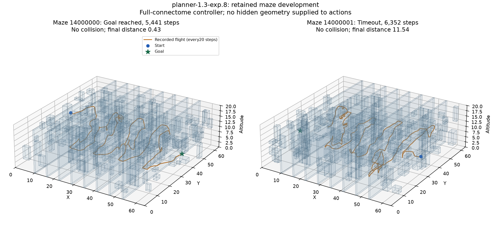

# Large-room corrections and maze navigation

This development work began on October 6, 2026. The task is to preserve large-room navigation while extending the explicit planner to the existing maze. A generated feasible maze is not a navigation result. The learned-policy objective remains separate.

## Current development status

Large-room controller `planner-1.3-exp.9` reaches all six retained cases and all eight fresh development rooms, without collisions or timeouts. Maze controller `planner-1.3-exp.11` reaches both original retained cases but only five of eight fresh development rooms. Those eight rooms are now retained for correction work. Exp.12 reaches six of eight; exp.13 reaches zero of eight. Both fail the declared development selection rule. Exp.14 completed with zero goals and one collision and was rejected. Exp.15 reached four goals without collisions and was rejected. Exp.16 reached four goals and was rejected. Exp.17 is checking clean mapping with initial-beacon surface alignment.

These are explicit-planning results using full-connectome activity, with no new optimization updates. They do not establish learned autonomous navigation or independent final-test generalization. The sections below retain the implementation history, including failed hypotheses.

## Room contract correction

Earlier planners assumed a 48 x 48 x 16 room when decoding the normalized goal distance and altitude. The maze is 64 x 64 x 20. Its altitude exceeded the original occupancy grid. Planner-1.3-exp.1 uses the declared room dimensions for both normalization and grid bounds, and commits to a local route reference until it is reached, blocked, or six seconds old. Existing measured planners remain unchanged and reject the maze contract.

Room dimensions are allowed configuration. Hidden obstacle boxes, true pose, generator seed, opening centers, and the certified route are not controller inputs. The controller estimates pose and reconstructs ranges from the full-connectome readout. True geometry is used afterward to audit flights.

## Development attempts

The two retained large rooms are 9500014 and 13000013. Their original episode deadlines remain 3,480 and 3,499 decisions. They were already inspected; corrections on them are development evidence, not independent generalization.

| Candidate | Mechanism | Retained large outcomes | Maze outcomes |
| --- | --- | --- | --- |
| planner-1.3-exp.1 | Room-aware decoding and committed references | One goal at 3,275 steps; one timeout | Two timeouts, no collisions |
| planner-1.3-exp.2 | Increase unknown-cell cost from 2.8 to 12 | Two timeouts; regression | Not run |
| planner-1.3-exp.3 | Detect broad vertical surfaces and through-rays; approach an opening before crossing | Two timeouts | Not run |
| planner-1.3-exp.4 | Angular-distance clustering, tall-surface filter, and completed-plane memory | Two goals at 3,343 and 2,056 steps; no collisions | Two timeouts, no collisions |
| planner-1.3-exp.5 | Consider multiple observed wall candidates and partially occluded vertical surfaces | Not measured | Two timeouts; regression |
| planner-1.3-exp.6 | Require beacon-aligned fitted surfaces and stronger support | Not measured | Two timeouts; regression |
| planner-1.3-exp.7 | Scale vertical surface support with observed plane distance | Not measured | Two timeouts |
| planner-1.3-exp.8 | Use clean neural ranges for occupancy and safety | Not yet measured | One goal at 5,441 steps; one timeout |
| planner-1.3-exp.9 | Raise bounded cruise request to 3.0 and tight request to 1.0 | Six retained goals, then eight fresh goals | Two timeouts; stationary regression |
| planner-1.3-exp.10 | Temporary stalled-reference veto | Not separately measured | One goal at 5,215 steps; one timeout |
| planner-1.3-exp.11 | Refine the same opening with stronger observed support | Not measured | Two goals at 6,630 and 6,028 steps; no collisions |

The exp.4 large-room flown distances were 218.23 and 149.39 units; final goal distances were 0.418 and 0.431. Both arrivals met the unchanged deadlines. This fixes two retained cases; broader large-room verification is still required.

The maze has eight narrow partitions, four dead-end branches, 192 boxes, and unchanged openings of 2.4 x 2.8. Seeds 14000000 and 14000001 have original deadlines of 6,736 and 6,352 decisions. Exp.1 timed out at goal distances 41.39 and 37.91. Exp.4 improved these to 22.71 and 29.69, but still failed. Its traces show partial partition progress and prolonged searches along walls. Progress is not success.

## Opening inference

The portal candidates fit vertical planes to reconstructed panoramic range endpoints. A ray that travels beyond a fitted surface suggests an opening. Intersections are clustered in wall tangent and altitude coordinates; the controller plans to a near-side approach and then a beyond-wall crossing reference. Candidate centers come from these observations, not from the map generator.

Exp.3 sometimes reacquired crossed surfaces and fitted clutter. Exp.4 requires a tall observed span and remembers completed planes. Its acceptance of a single through-ray provides an approach seed, not a proof that an opening fits the body. The debug counter `portal_crossings` counts inferred planes passed; it must not be reported as certified maze gates crossed.

Exp.5 tests another failure mode: the highest-support surface can have no visible opening while a secondary surface does. Its search considers multiple distinct planes and tolerates partial vertical occlusion. The sources and budget are recorded before launch. Results must be added before selecting it.

## Verification and limits

Every flight uses all 167,184 annotated neurons and 25,583,622 aggregated directed connections. There are zero training transitions and zero optimizer updates in these planner checks. A full regression run passed 404 tests before exp.5 was introduced.

Existing policy aliases and frozen planner implementations are protected by before/after SHA-256 hashes. The reserved final pools are not accessed. Diagnostics record all outcomes, physical transitions including inactive vector slots, source hashes, layout hashes, and elapsed compute. Detailed records stay in local `runs/diagnostics` and `private` directories; public evidence summarizes verified results.

The maze retry uses retained maps. It cannot establish independent generalization, a biological wiring advantage, a learned policy, or optimal routes. The default remains planner-1.0. Completion requires actual maze arrivals, retained large-room regression checks, a predeclared fresh development suite, and a rendered demonstration.

## Running experimental controllers

```powershell
.\launch-observed-map.cmd --controller-version 1.3-exp.4 --map-profile large --seed 9500014
.\launch-observed-map.cmd --controller-version 1.3-exp.5 --map-profile maze --seed 14000000
```

The second command currently selects a development candidate, not a verified maze solution. Opening a demo does not train or modify weights.

## Relevant formulas

The neural beacon returns a unit body-frame goal direction and distance normalized by the room diagonal. The room-aware decoder uses `distance * norm(room_size - 0.32)` and rotates the reconstructed vector into its estimated frame. Altitude uses `normalized_altitude * room_height`. These are engineering sensor contracts; the subtraction accounts for the simulation body margin.

For a candidate vertical plane with unit horizontal normal `n` and signed distance `d`, a ray direction `u` intersects at `t = d / dot(u_xy, n)`. A finite positive intersection within range becomes a through-ray candidate when its observed range exceeds `t + 1`. The one-unit allowance separates a surface return from evidence beyond it; it is not a collision clearance certificate.

Candidate intersections are grouped in tangent/altitude coordinates. Exp.4 uses radius `min(3.2, max(0.9, 0.35 + 0.17 * median(t)))`. The center is their coordinate-wise median projected onto the fitted plane. Selection minimizes approach distance plus 0.3 times remaining goal distance. The near-side reference is `center - 1.1 * normal`; the crossing reference is `center + 1.3 * normal`. Local occupancy search and flight safety remain active.

Exp.5 has a recorded unit-test failure: with a simple wall and centered opening it accepts a diagonal fit centered away from the real hole. This is a strict expected failure retained as evidence, not a passing geometry check. A subsequent candidate requires fitted normals to align with the observed initial beacon direction and restores the minimum 80 supporting endpoints. This adds a straight-corridor structural assumption; it is not a general solver for arbitrarily oriented mazes. It receives no true world heading or partition coordinates.


The subsequent full regression passed 408 tests with one strict expected failure for the discarded exp.5 detector. A 20-step offscreen maze flight with exp.6 produced finite full-graph activity, a rendered scene, complete transition chunks, and a clean archive integrity report. No complete episode was measured by that rendering check.


Exp.6 also regressed both retained maze flights, ending 56.04 and 44.43 units from the goal. Passing its simple opening fixture did not establish reliable surface inference in clutter. Exp.7 returns to the strongest-surface selection of exp.4 and changes the minimum vertical span to `min(0.65 * room_height, 3 * plane_distance)`. This is a development hypothesis about angular near-wall coverage; its full-flight results are pending.

[Per-room development outcomes](evidence/maze-navigation-development-results.md) retain every completed large and maze result from this iteration.


Exp.7 ended 26.12 and 29.53 units from the maze goals, without collisions; it did not solve the task. Exp.8 tests clean occupancy ranges instead of the 5%-context mapping channels. Both channels already come from the same full graph and fixed dual readout. No raw simulator ranges enter the full-flight controller. Earlier clean-range mapping regressed large navigation, so this candidate is not assumed better and needs separate large-room checks if it reaches maze goals.


## First actual maze arrival

Planner-1.3-exp.8 reached seed 14000000 at step 5,441, with 339.87 units flown and final goal distance0.430, without collision. Seed 14000001 timed out at 6,352 steps after 401.20 units, 11.54 units from its goal. These are reused development layouts. One arrival proves that the full-connectome controller can execute a complete flight through an actual maze, but it does not establish reliable maze navigation.



The figure uses every twentieth recorded position from the completed runs; geometry is shown afterward for explanation and was not supplied to the controller. It has no optimizer, new flights, or hidden-route overlay. Source records and figure hashes are retained in private/maze-first-arrival-figure.json.

A separate exp.4 large-room control check reached seeds 10000005,10000007,10000008 but timed out in 10000006, with no collisions. Its two known corrections therefore do not justify promoting it without broader regression checks. Exp.9 tests higher requested speed with the clean map. The 3.0 physical speed cap, directional clearance brake, momentum brake, geometry, and deadlines remain unchanged.


## Speed regression and blocked references

Planner-1.3-exp.9 reached all six retained large rooms, with no collisions. However, it timed out in both maze rooms. Seed 14000000 flew only 43.47 units and stopped near [15.03,29.03,4.90]. Its requested speed stayed zero, its actual speed was near zero, and its target remained roughly 0.8 units above. The ray-based stopping rule saw 0.25 units ahead, below the 0.27 stopping margin. Repeated planning selected the same blocked local direction. Higher requested speed is therefore not a maze solution.

Exp.10 adds an execution constraint without changing observed occupancy. If a local reference requests speed below 0.02 while estimated actual speed is below 0.05 for 25 consecutive decisions, its target grid cell receives a temporary traversal veto lasting 200 decisions. The controller clears that reference and replans. At 50ms per decision, these are 1.25 seconds of stall and 10 seconds of veto. The current cell is always exempt, and expiry restores the ordinary grid cost. The physical stopping rules remain active.

Tests verify that vetoes leave occupancy evidence unchanged, expire, do not trigger during movement, and do not leak into another controller reset. Exp.10 reached one maze goal and timed out in the other. A separate fresh development check was frozen on eight predeclared large seeds 15000000 through 15000007. Its rule requires at least 7/8 goals and zero collisions for the operational checkpoint, while reporting every outcome and Wilson uncertainty. It is not a reserved final assessment or a paired comparison.


## Verified large-room development checkpoint

Planner-1.3-exp.9 reached all six retained large cases and all eight fresh predeclared large cases, without collision or timeout. The fresh suite contains seeds 15000000 through 15000007; sources stayed frozen throughout, and all protected checkpoint and original-controller hashes match. It met the declared 7/8, zero-collision development rule. The 8/8 point estimate has a Wilson 95% interval of 67.6–100%, so it does not establish a population success rate above 80%.

The fresh check used 25,160 physical transitions, including inactive vector slots, in 281.83 seconds: 89.27 transitions/second. Peak allocated CUDA memory was 0.547 GiB. Every decision advanced the full annotated graph. No optimizer ran and no reserved final pool was evaluated. This is a fresh development checkpoint, not a paired improvement claim over earlier controllers.

Use `launch-observed-map.cmd --controller-version 1.3-exp.9 --map-profile large` to select this frozen candidate. The historical default remains planner-1.0; exp.9 is unsuitable for maze navigation because both retained maze flights timed out.

The recovery candidate exp.10 corrected the stationary maze case and reached its goal at 5,215 steps, without collision. The second case still timed out at 6,352 steps, 22.61 units from the goal. Exp.11 tests stronger same-plane opening-center evidence during approach, with the crossing reference frozen. It rejects weaker support, a different surface normal, a plane displacement above 0.4, and a tangent/altitude shift above 3 units. Stronger support blends the center with weight `new_support / (new_support + old_support)`. This is a measured-controller fork; maze results are pending.


## Both retained maze goals reached

Planner-1.3-exp.11 reaches 14000000 at 6,630 decisions and 14000001 at 6,028, without collision. Their deadlines remain 6,736 and 6,352. Flown distances are 420.76 and 392.08 units; final goal distances are 0.396 and 0.429. Sources and protected hashes match before/after. This corrects both retained maze cases; it is not yet a generalization result.

The controller is now frozen for eight fresh predeclared maze layouts, 16000000 through 16000007. The physical cap is 81,920 transitions with a 20-minute wall-clock safety bound, while each original episode deadline remains unchanged. The declared development rule is at least 7/8 goals and zero collisions, with every failure and Wilson uncertainty reported. No training or reserved final access is authorized by this check. Results are pending.

Full regression after center refinement: 420 passed, one expected failure retained for the discarded false-plane candidate. The new `launch-maze.cmd` executed a 20-step offscreen check with finite full-graph activity, controls exercised, and the separate anatomical soma window. This short rendering check is not counted as an episode success.


## Fresh maze result and next correction

The exp.11 fresh maze check completed at 5/8 goals, zero collisions, three timeouts. It failed the predeclared 7/8 threshold. The failures were 16000001 (33.51 units from goal), 16000004 (2.46), and 16000006 (15.18). These layouts are now retained development cases, not fresh evidence for a tuned successor. Full-source and protected hashes remained unchanged. Physical transitions: 56,048; elapsed 533.47 seconds; peak allocated CUDA memory 0.572 GiB.

The late failure 16000004 retained a portal whose beyond-wall crossing reference exceeded the goal's projected position; its local search repeatedly hit the expansion cap despite being close to the actual goal. Exp.12 adds goal-relative portal selection. A crossing must leave at least 1.3 units between the observed opening plane and the goal along its normal. Near the actual goal (distance below 5), it uses ordinary global occupancy planning rather than a new opening commitment. It also prefers that route when the complete estimated segment is observed free and has finite grid cost. This does not disable obstacle planning or braking, and unknown cells are not counted as observed free.

Exp.12 is frozen on all eight retained layouts to check both corrections and regressions. It has the same original episode deadlines and a bounded 81,920-transition cap. A subsequent fresh suite is permitted only after it passes the retained development rule. Results are pending.


## Goal-priority outcome and finer-grid check

Exp.12 reached 6/8 retained goals, with zero collisions and two timeouts. It corrected 16000006 but 16000001 still timed out, and 16000004 ended 29.20 units from the goal instead of the prior 2.46. It failed the 7/8 rule and is not selected.

Exp.13 returns to exp.11 opening refinement and changes occupancy resolution from 0.6 to 0.4 units. The one-voxel dilation remains one voxel, so its physical planning buffer also shrinks from 0.6 to 0.4. This is not an isolated precision-only ablation. The actual fly radius, room geometry, sensors, decision interval, speed cap, braking guards, and collision checks remain unchanged. The finer maze grid has 454 x 454 x 51 cells and covers the complete rotated-room envelope and 20-unit height.

The full graph is unchanged. Exp.13 is frozen on all eight retained layouts under the same development gate, original episode deadlines, and 81,920-transition cap. It must pass before another fresh suite. Results are pending.


### Maze follow-up: rejected fine grid and surface fallback

The retained check for `planner-1.3-exp.12` reached six of eight goals with no collisions. It corrected one previous failure but regressed another layout, so it was not selected. `planner-1.3-exp.13` then returned to the opening-refinement controller and changed the grid from 0.6 to 0.4 units. All eight retained flights timed out without collisions. The change also reduced the physical thickness of the one-cell planning buffer; it is not an isolated resolution ablation. This candidate was rejected.

`planner-1.3-exp.14` keeps the 0.6 unit grid and the existing flight guards. It checks other strongly supported surfaces when the highest-scoring surface has no observed through-rays, and hands over to global goal planning only within three units of the beacon. Its eight-layout retained check is running. It has no verified outcome yet. No optimizer update or reserved final evaluation was performed. Large-room development verification remains eight of eight fresh goals with `planner-1.3-exp.9`.


### Rejected surface fallback and confined-speed check

Exp.14 completed with zero of eight goals, one collision and seven timeouts. Its source and protected-checkpoint hashes remained unchanged. Broadening surface selection did not solve wall search and introduced a collision. It is rejected. Exp.15 returns to the exp.11 surface detector and0.6unit grid, increases the requested confined speed from 1.0 to 1.3 under unchanged range/momentum limits, and restricts goal handover to beacon distances below 3 units. Its retained eight-room check is running; no success claim is made. Four candidate contract tests pass. The previous full focused suite passed 145 tests with one expected failure.


### Confined-speed outcome and search-memory correction

Exp.15 reached four of eight retained maze goals, with zero collisions and four timeouts. It corrected 16000006 but lost prior successes in 16000000 and 16000007. Sources and protected checkpoints were unchanged. It is not selected. Raising a requested speed did not preserve reliable passage search.

Exp.16 retains exp.11 cruise and surface selection. Every tenth decision records a visit to the estimated current cell. After 600 decisions with less than 2 units of reduction in estimated beacon distance, it enables a bounded additive visit cost, `min(0.15 * visits, 4)`, while no portal is active. It never writes this preference into occupancy evidence, never makes blocked cells finite, and disables it during a committed opening approach/crossing. It retains close beacon handover below 3 units. Two tests verify evidence preservation, blocked-cell preservation, inactive portal behavior, and independent memory. Its eight-layout retained flight check is running; no outcome is claimed yet.


### Search-memory outcome and clean alignment check

Exp.16 completed at four of eight goals, zero collisions, four timeouts. It regressed 16000007 and failed all three earlier timeout cases. Visit pressure changed routes but did not establish reliable progress. All source and protected-checkpoint hashes remained unchanged. It is not selected.

Exp.17 combines exp.11 clean occupancy and center refinement with surface normals aligned to the initial observed beacon direction (`normal dot initial_direction >= 0.9`). It retains the original exp.11 cruise, grid, guards and portal planning. The earlier alignment-only candidate used context mapping and did not solve its two cases; this combination must be measured rather than assumed successful. It adds a declared straight-corridor structural assumption appropriate to the present procedural maze and is not a solver for arbitrary wall orientations. The controller receives no hidden heading, partition list, true pose or certified route. Two observed-gap/solid-wall tests pass. The full eight-layout retained check is running.
