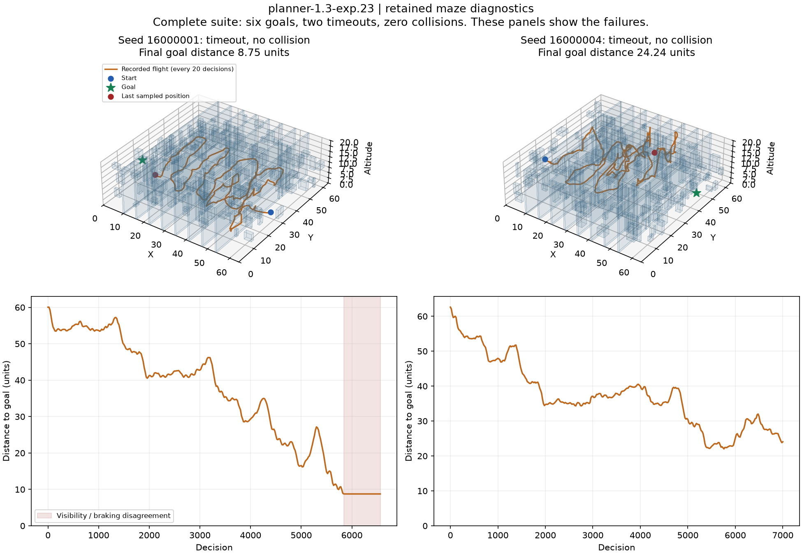

# Large-room corrections and maze navigation

This development work began on October 6, 2026. The task is to preserve large-room navigation while extending the explicit planner to the existing maze. A generated feasible maze is not a navigation result. The learned-policy objective remains separate.

## Current development status

Large-room controller `planner-1.3-exp.9` reaches all six retained cases and all eight fresh development rooms, without collisions or timeouts. Maze candidate `planner-1.3-exp.25` reaches seven of eight retained correction maps, then five of eight fresh development maps, with no collisions and three fresh timeouts. It failed the fresh seven-of-eight criterion and is not promoted. Maze reliability remains unresolved. Work is paused at the user's request; no training or navigation process from this verification remains active.

These are explicit-planning results using full-connectome activity, with no new optimization updates. They do not establish learned autonomous navigation or independent final-test generalization. The sections below retain the implementation history, including failed hypotheses.

## Room contract correction

Earlier planners assumed a 48 x 48 x 16 room when decoding the normalized goal distance and altitude. The maze is 64 x 64 x 20. Its altitude exceeded the original occupancy grid. Planner-1.3-exp.1 uses the declared room dimensions for both normalization and grid bounds, and commits to a local route reference until it is reached, blocked, or six seconds old. Existing measured planners remain unchanged and reject the maze contract.

Room dimensions are allowed configuration. Hidden obstacle boxes, true pose, generator seed, opening centers, and the certified route are not controller inputs. The controller estimates pose and reconstructs ranges from the full-connectome readout. True geometry is used afterward to audit flights.

## Development attempts

The two retained large rooms are 9500014 and 13000013. Their original episode deadlines remain 3,480 and 3,499 decisions. They were already inspected; corrections on them are development evidence, not independent generalization.

| Candidate | Mechanism | Retained large outcomes | Maze outcomes |
| --- | --- | --- | --- |
| planner-1.3-exp.1 | Room-aware decoding and committed references | One goal at 3,275 steps; one timeout | Two timeouts, no collisions |
| planner-1.3-exp.2 | Increase unknown-cell cost from 2.8 to 12 | Two timeouts; regression | Not run |
| planner-1.3-exp.3 | Detect broad vertical surfaces and through-rays; approach an opening before crossing | Two timeouts | Not run |
| planner-1.3-exp.4 | Angular-distance clustering, tall-surface filter, and completed-plane memory | Two goals at 3,343 and 2,056 steps; no collisions | Two timeouts, no collisions |
| planner-1.3-exp.5 | Consider multiple observed wall candidates and partially occluded vertical surfaces | Not measured | Two timeouts; regression |
| planner-1.3-exp.6 | Require beacon-aligned fitted surfaces and stronger support | Not measured | Two timeouts; regression |
| planner-1.3-exp.7 | Scale vertical surface support with observed plane distance | Not measured | Two timeouts |
| planner-1.3-exp.8 | Use clean neural ranges for occupancy and safety | Not yet measured | One goal at 5,441 steps; one timeout |
| planner-1.3-exp.9 | Raise bounded cruise request to 3.0 and tight request to 1.0 | Six retained goals, then eight fresh goals | Two timeouts; stationary regression |
| planner-1.3-exp.10 | Temporary stalled-reference veto | Not separately measured | One goal at 5,215 steps; one timeout |
| planner-1.3-exp.11 | Refine the same opening with stronger observed support | Not measured | Two goals at 6,630 and 6,028 steps; no collisions |

The exp.4 large-room flown distances were 218.23 and 149.39 units; final goal distances were 0.418 and 0.431. Both arrivals met the unchanged deadlines. This fixes two retained cases; broader large-room verification is still required.

The maze has eight narrow partitions, four dead-end branches, 192 boxes, and unchanged openings of 2.4 x 2.8. Seeds 14000000 and 14000001 have original deadlines of 6,736 and 6,352 decisions. Exp.1 timed out at goal distances 41.39 and 37.91. Exp.4 improved these to 22.71 and 29.69, but still failed. Its traces show partial partition progress and prolonged searches along walls. Progress is not success.

## Opening inference

The portal candidates fit vertical planes to reconstructed panoramic range endpoints. A ray that travels beyond a fitted surface suggests an opening. Intersections are clustered in wall tangent and altitude coordinates; the controller plans to a near-side approach and then a beyond-wall crossing reference. Candidate centers come from these observations, not from the map generator.

Exp.3 sometimes reacquired crossed surfaces and fitted clutter. Exp.4 requires a tall observed span and remembers completed planes. Its acceptance of a single through-ray provides an approach seed, not a proof that an opening fits the body. The debug counter `portal_crossings` counts inferred planes passed; it must not be reported as certified maze gates crossed.

Exp.5 tests another failure mode: the highest-support surface can have no visible opening while a secondary surface does. Its search considers multiple distinct planes and tolerates partial vertical occlusion. The sources and budget are recorded before launch. Results must be added before selecting it.

## Verification and limits

Every flight uses all 167,184 annotated neurons and 25,583,622 aggregated directed connections. There are zero training transitions and zero optimizer updates in these planner checks. A full regression run passed 404 tests before exp.5 was introduced.

Existing policy aliases and frozen planner implementations are protected by before/after SHA-256 hashes. The reserved final pools are not accessed. Diagnostics record all outcomes, physical transitions including inactive vector slots, source hashes, layout hashes, and elapsed compute. Detailed records stay in local `runs/diagnostics` and `private` directories; public evidence summarizes verified results.

The maze retry uses retained maps. It cannot establish independent generalization, a biological wiring advantage, a learned policy, or optimal routes. The default remains planner-1.0. Completion requires actual maze arrivals, retained large-room regression checks, a predeclared fresh development suite, and a rendered demonstration.

## Running experimental controllers

```powershell
.\launch-observed-map.cmd --controller-version 1.3-exp.4 --map-profile large --seed 9500014
.\launch-observed-map.cmd --controller-version 1.3-exp.5 --map-profile maze --seed 14000000
```

The second command currently selects a development candidate, not a verified maze solution. Opening a demo does not train or modify weights.

## Relevant formulas

The neural beacon returns a unit body-frame goal direction and distance normalized by the room diagonal. The room-aware decoder uses `distance * norm(room_size - 0.32)` and rotates the reconstructed vector into its estimated frame. Altitude uses `normalized_altitude * room_height`. These are engineering sensor contracts; the subtraction accounts for the simulation body margin.

For a candidate vertical plane with unit horizontal normal `n` and signed distance `d`, a ray direction `u` intersects at `t = d / dot(u_xy, n)`. A finite positive intersection within range becomes a through-ray candidate when its observed range exceeds `t + 1`. The one-unit allowance separates a surface return from evidence beyond it; it is not a collision clearance certificate.

Candidate intersections are grouped in tangent/altitude coordinates. Exp.4 uses radius `min(3.2, max(0.9, 0.35 + 0.17 * median(t)))`. The center is their coordinate-wise median projected onto the fitted plane. Selection minimizes approach distance plus 0.3 times remaining goal distance. The near-side reference is `center - 1.1 * normal`; the crossing reference is `center + 1.3 * normal`. Local occupancy search and flight safety remain active.

Exp.5 has a recorded unit-test failure: with a simple wall and centered opening it accepts a diagonal fit centered away from the real hole. This is a strict expected failure retained as evidence, not a passing geometry check. A subsequent candidate requires fitted normals to align with the observed initial beacon direction and restores the minimum 80 supporting endpoints. This adds a straight-corridor structural assumption; it is not a general solver for arbitrarily oriented mazes. It receives no true world heading or partition coordinates.


The subsequent full regression passed 408 tests with one strict expected failure for the discarded exp.5 detector. A 20-step offscreen maze flight with exp.6 produced finite full-graph activity, a rendered scene, complete transition chunks, and a clean archive integrity report. No complete episode was measured by that rendering check.


Exp.6 also regressed both retained maze flights, ending 56.04 and 44.43 units from the goal. Passing its simple opening fixture did not establish reliable surface inference in clutter. Exp.7 returns to the strongest-surface selection of exp.4 and changes the minimum vertical span to `min(0.65 * room_height, 3 * plane_distance)`. This is a development hypothesis about angular near-wall coverage; its full-flight results are pending.

[Per-room development outcomes](evidence/maze-navigation-development-results.md) retain every completed large and maze result from this iteration.


Exp.7 ended 26.12 and 29.53 units from the maze goals, without collisions; it did not solve the task. Exp.8 tests clean occupancy ranges instead of the 5%-context mapping channels. Both channels already come from the same full graph and fixed dual readout. No raw simulator ranges enter the full-flight controller. Earlier clean-range mapping regressed large navigation, so this candidate is not assumed better and needs separate large-room checks if it reaches maze goals.


## First actual maze arrival

Planner-1.3-exp.8 reached seed 14000000 at step 5,441, with 339.87 units flown and final goal distance0.430, without collision. Seed 14000001 timed out at 6,352 steps after 401.20 units, 11.54 units from its goal. These are reused development layouts. One arrival proves that the full-connectome controller can execute a complete flight through an actual maze, but it does not establish reliable maze navigation.


The figure uses every twentieth recorded position from the completed runs; geometry is shown afterward for explanation and was not supplied to the controller. It has no optimizer, new flights, or hidden-route overlay. Source records and figure hashes are retained in private/maze-first-arrival-figure.json.

A separate exp.4 large-room control check reached seeds 10000005,10000007,10000008 but timed out in 10000006, with no collisions. Its two known corrections therefore do not justify promoting it without broader regression checks. Exp.9 tests higher requested speed with the clean map. The 3.0 physical speed cap, directional clearance brake, momentum brake, geometry, and deadlines remain unchanged.


## Speed regression and blocked references

Planner-1.3-exp.9 reached all six retained large rooms, with no collisions. However, it timed out in both maze rooms. Seed 14000000 flew only 43.47 units and stopped near [15.03,29.03,4.90]. Its requested speed stayed zero, its actual speed was near zero, and its target remained roughly 0.8 units above. The ray-based stopping rule saw 0.25 units ahead, below the 0.27 stopping margin. Repeated planning selected the same blocked local direction. Higher requested speed is therefore not a maze solution.

Exp.10 adds an execution constraint without changing observed occupancy. If a local reference requests speed below 0.02 while estimated actual speed is below 0.05 for 25 consecutive decisions, its target grid cell receives a temporary traversal veto lasting 200 decisions. The controller clears that reference and replans. At 50ms per decision, these are 1.25 seconds of stall and 10 seconds of veto. The current cell is always exempt, and expiry restores the ordinary grid cost. The physical stopping rules remain active.

Tests verify that vetoes leave occupancy evidence unchanged, expire, do not trigger during movement, and do not leak into another controller reset. Exp.10 reached one maze goal and timed out in the other. A separate fresh development check was frozen on eight predeclared large seeds 15000000 through 15000007. Its rule requires at least 7/8 goals and zero collisions for the operational checkpoint, while reporting every outcome and Wilson uncertainty. It is not a reserved final assessment or a paired comparison.


## Verified large-room development checkpoint

Planner-1.3-exp.9 reached all six retained large cases and all eight fresh predeclared large cases, without collision or timeout. The fresh suite contains seeds 15000000 through 15000007; sources stayed frozen throughout, and all protected checkpoint and original-controller hashes match. It met the declared 7/8, zero-collision development rule. The 8/8 point estimate has a Wilson 95% interval of 67.6–100%, so it does not establish a population success rate above 80%.

The fresh check used 25,160 physical transitions, including inactive vector slots, in 281.83 seconds: 89.27 transitions/second. Peak allocated CUDA memory was 0.547 GiB. Every decision advanced the full annotated graph. No optimizer ran and no reserved final pool was evaluated. This is a fresh development checkpoint, not a paired improvement claim over earlier controllers.

Use `launch-observed-map.cmd --controller-version 1.3-exp.9 --map-profile large` to select this frozen candidate. The historical default remains planner-1.0; exp.9 is unsuitable for maze navigation because both retained maze flights timed out.

The recovery candidate exp.10 corrected the stationary maze case and reached its goal at 5,215 steps, without collision. The second case still timed out at 6,352 steps, 22.61 units from the goal. Exp.11 tests stronger same-plane opening-center evidence during approach, with the crossing reference frozen. It rejects weaker support, a different surface normal, a plane displacement above 0.4, and a tangent/altitude shift above 3 units. Stronger support blends the center with weight `new_support / (new_support + old_support)`. This is a measured-controller fork; maze results are pending.


## Both retained maze goals reached

Planner-1.3-exp.11 reaches 14000000 at 6,630 decisions and 14000001 at 6,028, without collision. Their deadlines remain 6,736 and 6,352. Flown distances are 420.76 and 392.08 units; final goal distances are 0.396 and 0.429. Sources and protected hashes match before/after. This corrects both retained maze cases; it is not yet a generalization result.

The controller is now frozen for eight fresh predeclared maze layouts, 16000000 through 16000007. The physical cap is 81,920 transitions with a 20-minute wall-clock safety bound, while each original episode deadline remains unchanged. The declared development rule is at least 7/8 goals and zero collisions, with every failure and Wilson uncertainty reported. No training or reserved final access is authorized by this check. Results are pending.

Full regression after center refinement: 420 passed, one expected failure retained for the discarded false-plane candidate. The new `launch-maze.cmd` executed a 20-step offscreen check with finite full-graph activity, controls exercised, and the separate anatomical soma window. This short rendering check is not counted as an episode success.


## Fresh maze result and next correction

The exp.11 fresh maze check completed at 5/8 goals, zero collisions, three timeouts. It failed the predeclared 7/8 threshold. The failures were 16000001 (33.51 units from goal), 16000004 (2.46), and 16000006 (15.18). These layouts are now retained development cases, not fresh evidence for a tuned successor. Full-source and protected hashes remained unchanged. Physical transitions: 56,048; elapsed 533.47 seconds; peak allocated CUDA memory 0.572 GiB.

The late failure 16000004 retained a portal whose beyond-wall crossing reference exceeded the goal's projected position; its local search repeatedly hit the expansion cap despite being close to the actual goal. Exp.12 adds goal-relative portal selection. A crossing must leave at least 1.3 units between the observed opening plane and the goal along its normal. Near the actual goal (distance below 5), it uses ordinary global occupancy planning rather than a new opening commitment. It also prefers that route when the complete estimated segment is observed free and has finite grid cost. This does not disable obstacle planning or braking, and unknown cells are not counted as observed free.

Exp.12 is frozen on all eight retained layouts to check both corrections and regressions. It has the same original episode deadlines and a bounded 81,920-transition cap. A subsequent fresh suite is permitted only after it passes the retained development rule. Results are pending.


## Goal-priority outcome and finer-grid check

Exp.12 reached 6/8 retained goals, with zero collisions and two timeouts. It corrected 16000006 but 16000001 still timed out, and 16000004 ended 29.20 units from the goal instead of the prior 2.46. It failed the 7/8 rule and is not selected.

Exp.13 returns to exp.11 opening refinement and changes occupancy resolution from 0.6 to 0.4 units. The one-voxel dilation remains one voxel, so its physical planning buffer also shrinks from 0.6 to 0.4. This is not an isolated precision-only ablation. The actual fly radius, room geometry, sensors, decision interval, speed cap, braking guards, and collision checks remain unchanged. The finer maze grid has 454 x 454 x 51 cells and covers the complete rotated-room envelope and 20-unit height.

The full graph is unchanged. Exp.13 is frozen on all eight retained layouts under the same development gate, original episode deadlines, and 81,920-transition cap. It must pass before another fresh suite. Results are pending.


### Maze follow-up: rejected fine grid and surface fallback

The retained check for `planner-1.3-exp.12` reached six of eight goals with no collisions. It corrected one previous failure but regressed another layout, so it was not selected. `planner-1.3-exp.13` then returned to the opening-refinement controller and changed the grid from 0.6 to 0.4 units. All eight retained flights timed out without collisions. The change also reduced the physical thickness of the one-cell planning buffer; it is not an isolated resolution ablation. This candidate was rejected.

`planner-1.3-exp.14` keeps the 0.6 unit grid and the existing flight guards. It checks other strongly supported surfaces when the highest-scoring surface has no observed through-rays, and hands over to global goal planning only within three units of the beacon. Its eight-layout retained check is running. It has no verified outcome yet. No optimizer update or reserved final evaluation was performed. Large-room development verification remains eight of eight fresh goals with `planner-1.3-exp.9`.


### Rejected surface fallback and confined-speed check

Exp.14 completed with zero of eight goals, one collision and seven timeouts. Its source and protected-checkpoint hashes remained unchanged. Broadening surface selection did not solve wall search and introduced a collision. It is rejected. Exp.15 returns to the exp.11 surface detector and0.6unit grid, increases the requested confined speed from 1.0 to 1.3 under unchanged range/momentum limits, and restricts goal handover to beacon distances below 3 units. Its retained eight-room check is running; no success claim is made. Four candidate contract tests pass. The previous full focused suite passed 145 tests with one expected failure.


### Confined-speed outcome and search-memory correction

Exp.15 reached four of eight retained maze goals, with zero collisions and four timeouts. It corrected 16000006 but lost prior successes in 16000000 and 16000007. Sources and protected checkpoints were unchanged. It is not selected. Raising a requested speed did not preserve reliable passage search.

Exp.16 retains exp.11 cruise and surface selection. Every tenth decision records a visit to the estimated current cell. After 600 decisions with less than 2 units of reduction in estimated beacon distance, it enables a bounded additive visit cost, `min(0.15 * visits, 4)`, while no portal is active. It never writes this preference into occupancy evidence, never makes blocked cells finite, and disables it during a committed opening approach/crossing. It retains close beacon handover below 3 units. Two tests verify evidence preservation, blocked-cell preservation, inactive portal behavior, and independent memory. Its eight-layout retained flight check is running; no outcome is claimed yet.


### Search-memory outcome and clean alignment check

Exp.16 completed at four of eight goals, zero collisions, four timeouts. It regressed 16000007 and failed all three earlier timeout cases. Visit pressure changed routes but did not establish reliable progress. All source and protected-checkpoint hashes remained unchanged. It is not selected.

Exp.17 combines exp.11 clean occupancy and center refinement with surface normals aligned to the initial observed beacon direction (`normal dot initial_direction >= 0.9`). It retains the original exp.11 cruise, grid, guards and portal planning. The earlier alignment-only candidate used context mapping and did not solve its two cases; this combination must be measured rather than assumed successful. It adds a declared straight-corridor structural assumption appropriate to the present procedural maze and is not a solver for arbitrary wall orientations. The controller receives no hidden heading, partition list, true pose or certified route. Two observed-gap/solid-wall tests pass. The full eight-layout retained check is running.


### Observed-clearance opening reference

Exp.17 reached five of eight retained goals without collisions. It corrected 16000006 but regressed 16000007, and 16000001/16000004 still timed out. It failed the 7/8 rule. Frozen-source and protected-checkpoint hashes matched before/after.

Exp.18 returns to exp.11 surface selection, grid, speed, guards and stronger-support refinement. Let `C` be through-ray intersections belonging to an observed opening cluster, and `W` be observed endpoints on its fitted surface. Both are represented in the wall tangent/height plane. The new reference is `argmax(p in C) min(w in W) ||p - w||`, followed by the existing projection onto the fitted plane. This replaces the median of visible through-rays, which can be biased toward the visible edge of a partially observed opening. It uses no known aperture size or hidden mesh.

The distance to sparse wall endpoints is a reference-selection heuristic, not a guaranteed continuous clearance radius. The actual fly body, collision model, range braking, momentum braking and episode deadlines remain unchanged. Three reference tests pass, including a fixture with the actual maze opening width 2.4 and height 2.8. The selected point lies inside that fixture with body clearance; this does not prove arbitrary sampled surfaces safe. The eight-layout retained full-connectome check is running. No optimizer or reserved final evaluation is involved.


### Neural-ray visible-goal handover

Exp.18 completed at five of eight retained goals, zero collisions and three timeouts. It corrected 16000006 and preserved 16000007, but regressed 16000000; 16000001 and 16000004 still timed out. Sources and protected hashes matched. It failed the 7/8 rule and is not selected.

Exp.19 returns to exp.11 opening inference, grid and cruise. It uses the current decoded local beacon vector and clean neural panorama ranges to recognize a direct goal corridor. For distance `d` below 23, choose the four panorama directions with greatest alignment to the beacon unit vector. Each must have dot product above 0.98 and projected range `r * alignment > d + 0.3`. If these observations pass, the controller relinquishes the opening reference and steers toward the beacon using the existing range/momentum flight guards. Otherwise normal opening planning continues.

This is sampled visibility, not a continuous swept-body clearance proof. No hidden geometry, true pose, certified route or seed enters the action controller. Two tests reject blocked and out-of-range handovers. The full retained eight-layout check is running with unchanged original deadlines and no optimizer or final reserved evaluation.


### Stable distant goal visibility

Exp.19 completed at six of eight retained goals, zero collisions and two timeouts. It corrected 16000006 and kept the other successes, but 16000001 and 16000004 still timed out. Source and protected hashes matched. It still fails the 7/8 rule, so no fresh suite or promotion followed.

Exp.20 retains exp.19 rays, ranges and flight law. A visible beacon below 8 units can hand over immediately. Between 8 and 23 units, all four nearest rays must pass the same visibility check for 20 consecutive decisions (one simulated second). A blocked observation immediately resets that counter and cancels handover. This tests whether brief distant visibility causes premature opening-reference changes. It is not a claim that flicker was proven to be the cause of every failure. Two continuity, cancellation and reset-memory tests pass; the full retained check is running with original deadlines.


## Completed handover checks and numerical repeatability

Planner-1.3-exp.20 and exp.21 each completed at six of eight retained maze goals, zero collisions and two timeouts. Seeds 16000001 and 16000004 remained failures. Both runs preserved their frozen source hashes and protected checkpoint hashes. Neither meets the predeclared seven-of-eight development rule, so no fresh maze suite or promotion followed. The original episode deadlines and physical geometry were preserved.

A separate numerical probe reset the full graph and replayed identical synthetic inputs twice, using eight slots and sixteen steps per replay. It advanced all 167,184 neurons and 25,583,622 directed edges. It performed zero environment transitions and zero optimizer updates. All outputs were finite, but feature values differed by up to 4.76837158203125e-7 and final neuron states by 1.1920928955078125e-7. A second probe with deterministic PyTorch algorithms and `CUBLAS_WORKSPACE_CONFIG=:4096:8` still differed, with maximum feature difference 5.364418029785156e-7. The installed runtime was PyTorch 2.7.1+cu128.

These probes establish small numerical variation for this execution path, not that it causes every navigation failure. Earlier recorded trajectories also diverged before goal handover was possible. The next prepared diagnostic converts the same full matrices to COO storage and checks repeatability; it has not run and has no result. Automatic approval review could not execute it because the account usage limit was reached. This was an unavailable approval review, not a judgment that the operation was unsafe.

Large navigation remains verified on six retained and eight fresh development rooms with planner-1.3-exp.9. Maze reliability remains unresolved. The demo continues to select exp.11, which reached both original retained maze cases and five of eight fresh development layouts. Later six-of-eight outcomes are on reused layouts and must not be presented as independent generalization. No training was initiated during these checks.


## Repeatable full-connectome execution

Execution became available again. The full COO probe still had numerical variation, so storage conversion alone was rejected as a repeatability solution. Ordered CSR accumulation using deterministic `index_add_` produced bit-identical features and final neuron states across both sixteen-step, eight-slot replays. The actual implemented `RepeatableDualActivityBrain` repeated that result on all 167,184 neurons and 25,583,622 edges: zero differing feature values, zero maximum feature/state difference, finite outputs, 32 full-graph steps, and zero environment transitions or optimizer updates. Its probe elapsed 6.477 seconds including initialization.

Planner-1.3-exp.22 keeps exp.19 visible-goal control and selects this explicit experimental readout. Sparse multiplication retains every signed matrix value and edge; it forms weighted presynaptic contributions and accumulates them in deterministic row order. The sensory projection, centering, recurrence, leak, nonlinearity and dual reconstruction formulas remain the same. The discarded pooled output is not computed by the new step method; it never feeds recurrent state or dual reconstruction. Floating-point accumulation order changes and therefore receives a separate readout/fingerprint: `neural-projection-dual-repeatable-index-add-v1`. Historical readouts and checkpoints remain unchanged.

Repeatability here is measured on this installed runtime and device, not guaranteed across hardware or library versions. It is also not a navigation-performance or biological-benefit claim. The eight retained maze layouts are under verification with the same 81,920 physical cap and original episode deadlines. A predeclared 30-minute wall-clock safety bound accommodates slower full-graph execution. All application source files and the runner are frozen by hash for this check. The development rule remains at least 7/8 goals with zero collisions before any new fresh suite. No training or reserved final evaluation is running.

## Repeatable execution follow-up

Exp.22 stopped at its predeclared 30-minute wall limit after 47,528 physical transitions. Five retained maze flights reached their goals, with no collisions; three flights were unfinished. This is an incomplete run, not a five-of-eight completed success rate. All frozen source and protected checkpoint hashes matched. No training or reserved-test evaluation occurred.

The brain inspector now recognizes the repeatable dual readout and correctly combines its two feature contributions. The old and both new readout contracts pass the three-case regression.

Exp.23 preserves exp.19 control logic and uses segmented sums over the complete CSR graph. Its numerical fingerprint differs from both the original CSR and exp.22 index-add kernels. A 32-call, batch-eight full-connectome probe produced finite, bit-identical replayed features and final neuron states: 167,184 neurons and 25,583,622 directed edges, zero physical transitions and optimizer updates. Total probe time was 3.51 seconds, including initialization; this is not a warmed throughput benchmark or a navigation result.

The eight retained maze flights are under verification with their original physical episode deadlines, an 81,920-transition cap, and a predeclared 45-minute wall limit. At least seven goals and zero collisions are required before another fresh development suite. All application source bytes and the diagnostic runner were frozen and archived before evaluation. The numerical optimization retains every neuron, edge, signed weight and sensory projection; it changes summation order, not the physical environment. The large-map launcher remains exp.9 and the maze launcher remains exp.11 until new complete evidence warrants a change.

### Maze search diagnosis from retained seed 16000001

Post-flight exp.19 traces show that the flight remained near the first partition until roughly decision 3,620, with no inferred portal crossings. Its sampled actual x coordinate stayed approximately 55 from decisions 400 through 3,600, while y and altitude varied repeatedly. An opening was acquired at 3,620 and the first crossing completed around 3,820. Five inferred plane crossings were recorded by 6,560, shortly before the original 6,562-decision timeout. Estimated pose error at that final sampled decision was about 0.00045, and yaw error about 0.000017 radians. This evidence points to inefficient opening discovery on this retained case rather than a final-goal stopping error or a large pose drift. The crossing counter is not a certified gate count. Actual coordinates are diagnostic output only and will not be fed back into navigation. A future correction should survey a blocking observed surface systematically when no through-ray opening is visible, rather than repeatedly choose speculative routes toward the beacon.

## Completed segmented run and observed-wall correction

Planner-1.3-exp.23 completed all eight retained maze flights: six goals, zero collisions and two physical episode timeouts. Successful decision counts were 4,608 (16000003), 5,053 (16000005), 5,200 (16000000), 5,448 (16000007), 5,496 (16000002) and 6,194 (16000006). Seed 16000001 timed out at 6,562 decisions, 8.75 units from its goal; seed 16000004 timed out at 7,006 decisions, 24.24 units away. The run used 56,048 physical transitions, took 1,268.79 seconds and allocated a peak 1.952 GiB of VRAM. All source and protected checkpoint hashes matched. There were no optimizer updates or reserved-test evaluations. It failed the existing seven-of-eight criterion and was not selected.

Planner-1.3-exp.24 addresses the observed first-partition search delay. If no opening is acquired for 80 decisions, it fits a nearby broad blocking surface from clean neuronal range endpoints, chooses a near-side sweep reference two units from that surface and moves along its tangent in four-unit increments. After 160 decisions without improving distance to the survey target, it reverses direction. Opening acquisition or a ray-supported visible goal cancels the survey. Original route occupancy, body geometry, braking, speed limits and physical deadlines are unchanged. The survey is enabled for the maze contract; it receives no hidden obstacle list, true pose or certified route.

Twelve focused tests passed, covering surface fitting, rejection of distant surfaces, near-side reference geometry, sweep continuation, reversal, independent episode search state and versioned policy selection. All eight retained maze flights are now under a separately frozen diagnostic, with the same 81,920-transition cap, original episode deadlines and a predeclared 45-minute wall limit. The entire 117-file runtime source set is archived byte-for-byte. No navigation improvement is claimed until the flights complete. No fresh maze suite or promotion has occurred.

### Goal handover disagreed with near-body braking

In the completed exp.23 failure for seed 16000001, 37 sampled records from decisions 5,840 through 6,560 report `direct_goal_visible=true` while requested speed is zero. The final sampled braking clearance is 0.193 units and actual speed is approximately zero. This explains its flat distance curve late in the flight: sparse panoramic goal rays allowed handover, while the broader near-body point set vetoed translation. Estimated pose drift remained below 0.001 units in that sample. This is a measured controller inconsistency, not a claim that every maze timeout has the same cause.

A separately prepared correction checks the same 0.25-unit corridor radius used by braking against all nonsaturated short and panoramic range endpoints before goal handover. Maximum-range returns are excluded as surfaces. It also completes an active opening approach/crossing before handing control to the goal. Saturation, nearby obstruction and active-crossing regression fixtures pass, with zero environment transitions. The correction is not part of the frozen exp.24 run and has no flight result yet.



These are post-flight plots of the existing saved layouts and trajectories, sampled every 20 decisions. The left shaded interval marks the observed goal-visibility/braking disagreement. Hidden geometry is used only for this diagnostic figure and is not a controller input. The complete suite result remains six goals, two timeouts and no collisions.

## Wall survey result and isolated handover correction

Planner-1.3-exp.24 completed at six retained goals, zero collisions and two timeouts. It reached seeds 16000007/06/02/05/01/04 in 4,452/4,492/4,580/4,855/5,588/5,652 decisions. Both previous failures were fixed, but 16000003 and 16000000 regressed to timeouts at 6,535 and 6,885 decisions, ending 24.49 and 36.79 units from the goal. It used 55,080 physical transitions, took 1,321.94 seconds, and peaked at 1.952 GiB allocated VRAM. All source and protected checkpoint hashes matched; no optimization or reserved evaluation occurred. It failed the existing gate and was not selected. Surveying was helpful on several layouts but did not preserve prior successful behavior.

Planner-1.3-exp.25 isolates the visibility/braking correction on exp.23, without the rejected wall survey. It requires no nonsaturated short or panoramic endpoint inside the same 0.25-unit corridor used by braking before direct goal handover. Saturated maximum-range values are not treated as wall hits. An active opening approach/crossing must complete before goal handover. Sensor, connectome, geometry, speed, collision and episode-deadline contracts remain unchanged. Thirteen focused geometry/visibility/version tests passed. The eight retained maps are running with original episode deadlines, the 81,920-transition cap and a separately declared 45-minute wall limit. All 118 runtime source files are frozen and archived. No flight improvement is claimed until the check completes, and no fresh suite or promotion has occurred.

## Clearance-aware handover: retained gate passed

Planner-1.3-exp.25 completed the eight retained maze flights at seven goals, zero collisions and one timeout. Arrival decisions were 4,710 (16000003), 5,051 (16000005), 5,200 (16000000), 5,544 (16000002), 5,614 (16000007), 5,909 (16000001) and 6,357 (16000006). The remaining seed 16000004 timed out at its original 7,006-decision limit, 24.24 units from its goal. The visibility/braking deadlock in 16000001 was corrected, and all six exp.23 successes were preserved.

The check used 56,048 physical transitions and zero optimizer updates, took 1,273.43 seconds, and peaked at 1.952 GiB allocated VRAM. The full 167,184-neuron, 25,583,622-edge graph was retained. All frozen source and protected checkpoint hashes matched. This passes the predeclared seven-of-eight retained gate. It is tuned development evidence, not an independent success-rate estimate or a biological advantage claim.

A separate frozen prospective development suite is now running on seeds 17000000–17000007. An integer-bounded audit of 1,769 archived JSON/Markdown records found no previous occurrences before its seed declaration; undocumented use cannot be ruled out by that audit. No candidate-room geometry was generated or inspected before launch. The fresh run uses exactly the same 118 runtime source hashes as the completed retained run, with an 81,920-transition cap, original physical episode deadlines and a predeclared 45-minute wall limit. At least seven fresh goals and zero collisions are required. The source bytes are archived separately. There is no tuning, optimization, reserved-test access, checkpoint modification or demo promotion during this check. Its outcomes are pending.

## Completed fresh maze check and requested pause

Planner-1.3-exp.25 finished its frozen prospective maze check at **5/8 goals (62.5%)**, zero collisions and three timeouts. The Wilson 95% interval is **30.6–86.3%**. This is a small development sample, not the reserved final test and not an independent paired comparison with exp.11. Its earlier 7/8 retained outcome is tuned correction evidence and must remain separate.

| Fresh seed | Outcome | Decisions | Final goal distance |
| --- | --- | ---: | ---: |
| 17000000 | Goal | 5,916 | 0.439 |
| 17000001 | Goal | 4,090 | 0.443 |
| 17000002 | Timeout | 6,752 | 22.160 |
| 17000003 | Goal | 4,905 | 0.405 |
| 17000004 | Goal | 5,434 | 0.422 |
| 17000005 | Timeout | 6,534 | 20.371 |
| 17000006 | Goal | 5,473 | 0.417 |
| 17000007 | Timeout | 6,666 | 13.211 |

The run completed all eight original episode deadlines with no incomplete flights. It used 54,016 physical transitions, took 1,234.24 seconds and peaked at 1.952 GiB allocated VRAM. Every transition used the full 167,184-neuron, 25,583,622-edge graph. All 118 frozen runtime sources and every protected checkpoint alias matched their before/after hashes. There were zero optimizer updates and no reserved-test access. The process exited normally.

The fresh seven-of-eight criterion was not met, so exp.25 is not promoted. The large launcher remains exp.9, with its six retained and eight fresh goals. The maze launcher remains exp.11. Large-room development criteria are met; reliable maze navigation remains unresolved. The three new timeouts require search/reference diagnosis when work resumes. These newly inspected maps are now correction data for future changes, not reusable fresh evidence.

Navigation, connectome and visualization integration checks passed: 212 passed and one expected failure for a rejected historical candidate. Repository checks passed for 79 documents, 378 links, module imports and CLI help; the public-file audit had no errors. No additional training or navigation experiments followed this check. At the user's request, work pauses after saving and pushing these results; a selected-candidate rendered demo check is deferred until the navigation criterion is met.


## October 7: Opening-range diagnosis

Work resumed on the maze before integration of the revised architectural scenes. The three exp.25 fresh timeouts are now retained correction cases. Their archived sampled traces show active motion rather than a stationary brake lock, with small estimated pose errors. Seed 17000005 ends with a crossing reference and a 12,000-expansion search that has not reached it; its inferred plane count must not be confused with actual partition crossings. Seeds 17000002 and 17000007 continue searching without an active opening at the end.

Planner-1.3-exp.26 preserves exp.25 and its near-opening detector. Only when that detector finds no opening does a fallback extend the fitted-plane distance window from 6 to 12 units, within the unchanged 24-unit panoramic range. It uses the same observed rays, support, completed-plane memory and approach/crossing logic. Seven focused range/handover tests pass. This is a hypothesis about earlier discovery, not a proven navigation correction.

A bounded check is running on the already inspected eight seeds 17000000–17000007, with the full 167,184-neuron, 25,583,622-edge connectome, frozen sources, unchanged physical deadlines, at most 81,920 transitions and a 45-minute wall limit. There are no optimizer updates, hidden geometry inputs or reserved tests. A passing retained check is necessary but not sufficient: preserve the earlier retained suite, declare a new unused frozen development suite, and inspect the selected demo before promotion. Current launchers are unchanged.

An additional offline inspection cast synthetic rays at archived true poses to examine detector opportunities. That inspection is privileged diagnosis only, omits replay of completed-plane memory, is not a flight result and supplies no inputs to the live full-connectome check. It found one extra candidate among the sampled failure frames, so range extension alone may not address the remaining search failures. Detailed trace hashes and diagnosis records remain in private/.


### Range correction outcome and bounded search recovery

Exp.26 completed all eight retained flights: **6/8 goals, zero collisions and two timeouts**. It fixes 17000005 at 4,205 decisions and preserves all five exp.25 successes. Seed 17000000 arrives at 6,720 decisions, slower than before; the other preserved arrivals retain their previous times. Seeds 17000002 and 17000007 time out at the same final distances, 22.16 and 13.21 units. All source and protected hashes match. The check used 54,016 physical transitions with no optimization or reserved-test access; it did not meet the retained gate and is not promoted.

Exp.27 keeps the range correction and tests bounded observed-wall recovery after 320 ticks without at least one unit of longitudinal progress along the initial beacon direction. This is an explicit corridor-oriented search assumption, not a hidden partition list. A detected broad blocking wall seeds a local tangent scan. Targets require finite mapped corridor costs and current panoramic-ray clearance; stalled or unreached references are marked in separate search memory rather than rewriting occupancy. Each scan expires after 400 ticks, and a detected opening or clear direct-goal corridor cancels it. Unlike the rejected early survey, it does not intervene while longitudinal progress continues and does not keep an unreachable target indefinitely.

Eleven focused opening/handover/search tests pass. A frozen bounded retained check on 17000000–17000007 is the next measurement; no stronger navigation claim follows from these implementation checks. Preserve original room deadlines, collision checks, full-connectome activity and checkpoint hashes.


### Progress-only recovery regresses; revisit gating

Exp.27 completed at **4/8 retained goals, zero collisions and four timeouts**. It reaches 17000007, which exp.26 missed, but regresses 17000000, 17000003 and 17000006. It is rejected. The full graph and all protected/frozen hashes match; there are no optimizer updates or reserved tests.

| Seed | Outcome | Decisions | Final goal distance |
| --- | --- | --- | --- |
| 17000000 | Timeout | 6753 | 25.697 |
| 17000001 | Goal | 5541 | 0.419 |
| 17000002 | Timeout | 6752 | 5.504 |
| 17000003 | Timeout | 6462 | 23.755 |
| 17000004 | Goal | 4771 | 0.390 |
| 17000005 | Goal | 5340 | 0.446 |
| 17000006 | Timeout | 6644 | 10.621 |
| 17000007 | Goal | 5659 | 0.415 |

The check used 54,024 physical transitions, took 753.51 seconds and peaked at 1.952 GiB allocated VRAM. Slow longitudinal progress alone does not distinguish necessary lateral/vertical exploration from an unproductive loop.

Exp.28 changes the scan-initiation gate: estimate position-cell novelty every 20 decisions, retain a 16-sample window, and require fewer than four newly visited 2-unit cells for three consecutive samples without an active opening. A scan already in progress keeps its original expiry and target-recovery rules. Original opening detection, normal exploration, clearance handover, full graph, physical deadlines, speed and collisions are unchanged. This threshold is a tuned development hypothesis derived from retained controller-pose traces; it is not independent evidence.

Seventeen focused opening/handover/scan tests pass, including independent visit histories, delayed initiation and preserving active-scan expiry. A frozen eight-map retained check is running with the same transition and wall limits; no promotion or fresh evaluation follows until its gate and earlier regressions pass.
