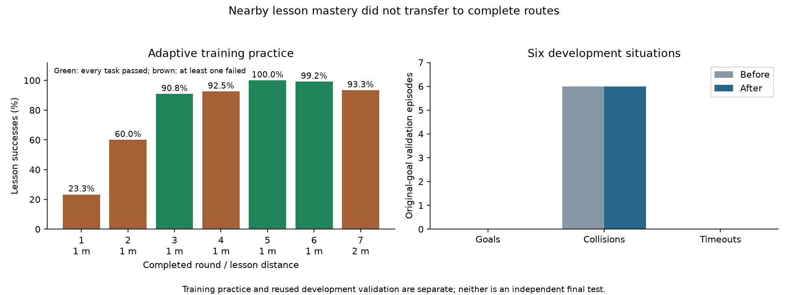

# Autonomous architectural curriculum 2 results

Completed on October 7, 2026 with 131,072 fresh PPO transitions using all 167,184 annotated neurons and 25,583,622 edges. No planner chose student actions. The balanced scheduler reached the 2 metre stage, but original-goal validation ended with zero goals, six collisions and zero timeouts. Autonomous navigation through the full architectural tasks remains unresolved.

## What changed

The previous curriculum spent 4,096 transitions per task in a fixed cycle. This experiment used 1,024-transition lesson chunks and skipped tasks whose eight-episode mastery windows were already full. The encoder, PPO settings, scenes, reward and two-consecutive-round criterion were retained. This was a fresh single-seed run, not a continuation of the previous checkpoint.

## Training evidence

At 1 metre: 1,595 completed episodes, 1,384 goals, 133 collisions and 78 timeouts.

At 2 metres: 494 completed episodes, 467 goals, 25 collisions and 2 timeouts.

The six complete 1 metre rounds had 28, 72, 109, 111, 120 and 119 goals out of 120. Rounds 5 and 6 passed consecutively, allowing progression to 2 metres. The first complete 2 metre round had 112/120 goals, but warehouse situation 0 scored 5/8, below the per-task minimum of 6/8. The next round remained incomplete at the budget limit. Neither 4 metre lessons nor original-goal training were reached. These lesson goals use unobstructed straight segments from the original starts; their success does not establish obstacle detours, longer routes or independent generalization.

## Original-goal validation

Before and after training: 0/6 goals, six collisions, zero timeouts.

| Scene | Steps | Final distance (m) | Outcome |
| --- | --- | --- | --- |
| office-floor | 45 | 3.875 | Collision |
| apartment | 47 | 2.374 | Collision |
| street-block | 28 | 13.670 | Collision |
| atrium | 161 | 10.793 | Collision |
| warehouse | 196 | 4.299 | Collision |
| courtyard | 148 | 17.197 | Collision |

The previous curriculum achieved 1/6 goals on this same development validation. The balanced scheduler improved curriculum progression but did not improve full-route validation. These six situations share inspected scene geometry and have informed development repeatedly; they are not a reserved test or independent unseen-building evidence. A single seed is insufficient for a reliable ranking.

## Verification and interpretation

Training took 3,589.469 seconds, excluding validation. Peak allocated VRAM was 0.773 GiB. All losses were finite; checkpoint reload matched the deterministic action. There were 256 PPO rollouts and 1,280 optimizer epoch passes. Frozen source hashes and all six protected alias hashes were unchanged. No checkpoint was promoted and no reserved test was accessed. The separate 128-transition smoke is excluded from this training budget.

The observed limitation is that short, unobstructed lessons do not yet transfer to complete routes. The next implementation should preserve exposure to original goals during curriculum learning, retain practice progress when resuming, and verify obstacle-route behavior separately. Keep the planner as a reference or teacher only; student evaluation must remain learned and autonomous. Do not lower acceptance criteria to make this completed run appear successful.

Local evidence is in `runs/training/autonomous-architecture-curriculum-2/`; detailed logs and exact source bytes are archived in `private/autonomous-architecture-curriculum-2-evidence/`.

## Recorded transfer gap

Reproduce this figure from existing logs with `scripts/plot_architectural_curriculum.py`. The plot does not load a policy or run evaluations.
