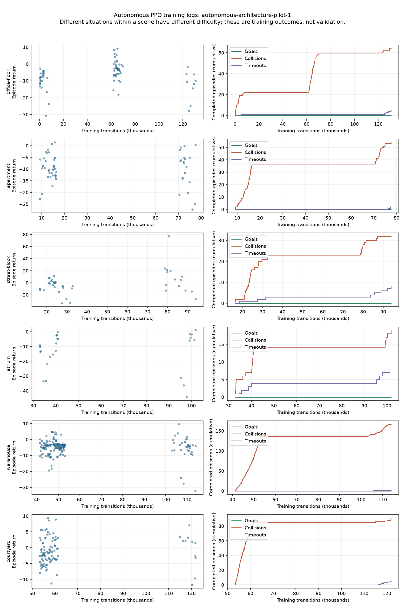

# Autonomous PPO pilot 1 results

The fresh planner-free policy completed 131,072 training transitions across 15 situations in six inspected architectural scenes. It reached **zero goals in 457 completed training episodes**. Pre/post validation both reached **0/6 goals**; post-validation ended in five collisions and one timeout. The policy is not promoted. These validation situations share scene geometry with training and are not independent building generalization evidence.

## Training outcomes

| Scene | Situation index | Episodes | Goals | Collisions | Timeouts |
| --- | ---: | ---: | ---: | ---: | ---: |
| office-floor | 0 | 48 | 0 | 46 | 2 |
| office-floor | 1 | 21 | 0 | 18 | 3 |
| apartment | 0 | 23 | 0 | 23 | 0 |
| apartment | 1 | 33 | 0 | 31 | 2 |
| street-block | 0 | 10 | 0 | 9 | 1 |
| street-block | 1 | 16 | 0 | 14 | 2 |
| street-block | 2 | 8 | 0 | 6 | 2 |
| street-block | 3 | 6 | 0 | 3 | 3 |
| atrium | 0 | 11 | 0 | 6 | 5 |
| atrium | 1 | 16 | 0 | 13 | 3 |
| warehouse | 0 | 37 | 0 | 36 | 1 |
| warehouse | 1 | 59 | 0 | 59 | 0 |
| warehouse | 2 | 73 | 0 | 72 | 1 |
| courtyard | 0 | 54 | 0 | 51 | 3 |
| courtyard | 1 | 42 | 0 | 40 | 2 |

The full 167,184-neuron, 25,583,622-edge connectome and policy ran in CUDA. Training took 3,003.39 seconds (50.06 minutes), excluding pre/post validation; peak allocated VRAM was 0.638 GiB. There were 256 PPO rollouts and 1,280 optimizer epoch passes. Losses remained finite and checkpoint reload matched deterministic actions. Frozen sources and original checkpoint aliases matched. There was no planner assistance, imitation or reserved-test access.

## Diagnosis and next correction

The absence of training goals means the failure cannot be attributed only to held-out task generalization. Positive progress reward on some long street flights did not imply arrival. The experiment switched training cases every 4,096 steps, distributing the budget across 15 tasks; this is a limited initial exposure, not evidence that PPO or the connectome cannot solve the tasks.

The first encoder mixed 5,669 coordinates through one dense compression and layer normalization. A representation problem is a hypothesis, not a proven root cause. The next candidate preserves panorama neighborhoods with learned circular convolutions, separately encodes near-body ranges and keeps the 13 neural goal/state coordinates directly available to the action/value network. It applies no hand-written action rule. A gradient/input-contract test passes; the candidate still requires a full-connectome PPO smoke and bounded training before any performance claim.

Next also inspect learning on short training objectives or a declared curriculum and mixed-task rollout sampling. Any easier training task must be labeled as curriculum, while evaluation keeps original endpoints, geometry and deadlines. Do not silently replace the architectural task with easier acceptance cases or return to a planner choosing student actions.

## Training curves



Each row separates a scene; points are completed training episode returns and lines count goals, collisions and timeouts. Different situations within a scene have different difficulty. Gaps show training on other scenes, not unrecorded evaluation. A positive return can reflect physical progress without arrival; all goal curves remain zero. There were 427 collisions and 30 timeouts among the 457 completed episodes. Partial episodes at scheduled task switches are not counted as completed flights.

Regenerate this figure from existing logs without running a policy:

```powershell
.\.conda\python.exe -s scripts/plot_autonomous_training.py runs/training/autonomous-architecture-pilot-1 reports/autonomous-pilot-1-learning.png
```

The same command can plot a live run into reports; it ignores only an incomplete final append line and raises on earlier malformed records. It does not load checkpoints, train, evaluate or modify experiment logs.
