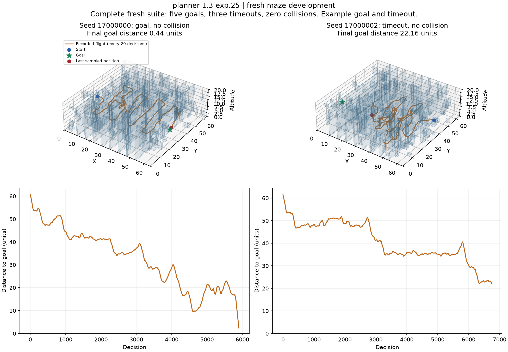

# Fresh maze result: planner-1.3-exp.25

The frozen controller reached five of eight new maze goals, with zero collisions and three timeouts. Its 62.5% success estimate has a Wilson 95% interval of 30.6–86.3%. It failed the predeclared seven-of-eight criterion and is not promoted. The earlier seven-of-eight retained outcome measures correction on reused maps; these results do not establish learned-policy success or a connectome advantage.

The check used all 167,184 annotated neurons and 25,583,622 directed edges, with 54,016 physical transitions, zero optimizer updates and no reserved-test access. It finished in 1,234.24 seconds with peak allocated VRAM of 1.952 GiB. The 118 runtime source hashes and all protected checkpoint hashes matched before and after. Detailed source, trajectory and preservation evidence is retained in the private/local run archives.

The examples are the lowest-numbered successful seed and the lowest-numbered timeout seed, selected after the complete result. Positions are sampled every 20 decisions; titles report the final episode distance. Hidden geometry appears only in this post-flight plot and is not a controller input. This is not an interactive demo inspection.

[Complete counts, attempts, limits and next work](../MAZE_NAVIGATION.md#completed-fresh-maze-check-and-requested-pause).

Work pauses at the user's request. The large demo keeps its verified exp.9 controller; the maze demo keeps exp.11. The next session should diagnose the three new timeouts before another fresh suite, preserve the existing successful cases and inspect the selected demo only after its criterion passes. No process from this verification remains running.
