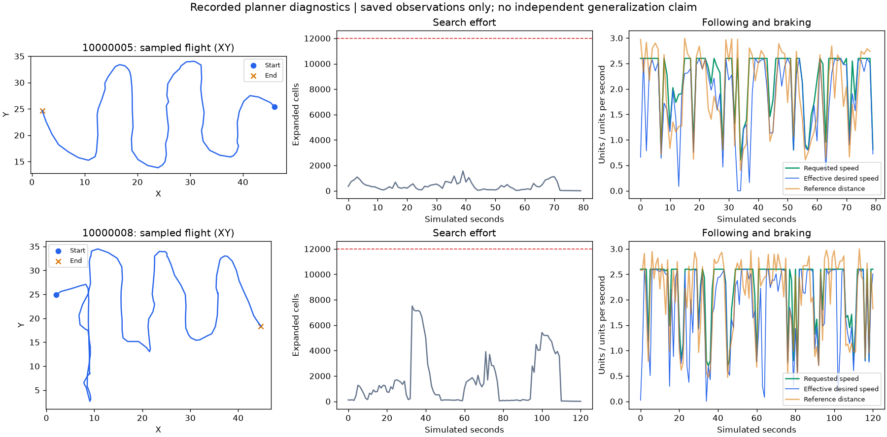

# Actual-motion braking correction

V61 fixed a stationary known case but regressed its next sixteen-room comparison. Two collisions occurred while its route direction and physical motion were changing. The braking calculation checked the requested direction, which is not necessarily the direction inertia carries the fly. This report retains the subsequent known-case correction separately from fresh development measurements.

## Hypothesis and rule

V64 inherits v61's distance-stable readout, observed map, search, margin recovery, and route following. It adds a clearance check along measured body-frame velocity. Both the requested-direction check and actual-motion check use endpoints reconstructed from neuron activity, the same 0.25-unit tube, and the existing 0.27-unit clearance allowance. No hidden geometry or true pose enters actions.

For measured velocity `v`, speed `s = norm(v)`, and direction `u = v / max(s, 1e-8)`, project reconstructed endpoints `p` along `u`. The nearest positive projection whose perpendicular distance is less than 0.25 gives `L_motion`. The additional speed limit is:

```text
motion_limit = sqrt(2.4 * max(L_motion - 0.27, 0))
guard = speed > 0.1 and speed > motion_limit
```

When the guard is active, desired horizontal and vertical velocity become zero. Existing proportional controls request deceleration, while steering still follows the route. This is a simplified stopping-distance check, not a proof of collision avoidance. Sparse rays, discretization, latency, and turning dynamics still limit safety. It does not weaken physical collision detection or extend deadlines.

The trace retains both pre-guard `requested_speed` and post-guard `effective_desired_speed`, plus `actual_speed`, `momentum_ahead`, and `momentum_guard`. A nonzero requested speed can therefore coexist with a braking action; analyses must not treat it as the applied speed.

## Known-case recheck

Four contiguous previously inspected rooms were declared before either arm ran. Each arm had a 12,000-physical-transition cap with four vector slots, allowing at most 3,000 decisions per slot. Both completed all four original episodes within that cap. V61 reproduced both collisions from the sixteen-room comparison; two successful rooms served as controls.

| Known room | V61 | V64 |
| ---: | --- | --- |
| 10000005 | Collision at step 664; 58.36 units flown | Goal at step 1,582; 138.98 units flown |
| 10000006 | Goal at step 1,708; 150.18 units flown | Goal at step 1,708; 150.18 units flown |
| 10000007 | Goal at step 1,514; 130.72 units flown | Goal at step 1,514; 130.72 units flown |
| 10000008 | Collision at step 684; 55.86 units flown | Goal at step 2,415; 202.45 units flown |

V61 used 6,832 physical transitions; v64 used 9,660. Finished vector slots still step until other slots complete, so these totals differ from the sum of scored episode lengths. V64 reached 4/4 with zero collisions and zero timeouts. The two successful controls retained their arrival steps and paths to numerical precision. All frozen sources and original alias hashes passed. Neither flight optimized weights or accessed a reserved test.

Earlier batch-one audits of the two collision rooms did not reproduce either collision within separately capped 1,024-step prefixes, adding 2,048 audit transitions without completed episodes. The later matched four-instance recheck did reproduce them. Neither incomplete prefix is counted as a navigation success or used to dismiss the recorded collisions. Batch-dependent numerical behavior remains a reproducibility consideration.

## Saved-trace inspection

The [offline diagnostic tool](../../scripts/plot_planner_diagnostics.py) now supports individual seeds and recorded strides, checks sample order and finite positions, and distinguishes route reuse from new searches. The figure below uses the corrected known-case flights, sampled every twenty decisions; it is not an independent performance measurement.



Sampled paths underestimate full flown length, and the XY projection hides altitude. Two and one sampled decisions, respectively, show the momentum guard active; sampling does not count every guarded decision. Goal outcomes and full flown lengths come from terminal records and every physical scored displacement, rather than these sampled curves.

## Readout history and optimizer verification

A full-graph verification attempt exposed a separate factory/extractor mismatch before any physical steps or optimizer updates: history extraction accepted only 256 features, whereas projection readers emit 3,869. The residual GRU extractor now uses its declared observation width. Existing 256-feature legacy transfer retains its architecture and parameters; high-dimensional projection history can initialize and reload without silently flattening its contract.

The repaired verification used exactly 128 physical transitions and one PPO update with all 167,184 neurons and 25,583,622 connections. Losses were finite, model parameters changed, and deterministic actions matched exactly after CPU reload. The temporary checkpoint and metadata were deleted. This is pipeline verification, not substantive training or evidence that a learned student navigates large rooms. Existing checkpoints and aliases were unchanged.

## Fresh measurement

V60 and v64 are frozen separately for a new paired development suite on seeds 11000000–11000015. The readout difference is declared, graph/layout/projection contracts must match, and each arm is capped at 81,920 physical transitions with the user's 20:30 UTC cutoff. Known-case 4/4 is not added to historical prospective percentages. A conclusion about fresh navigation requires both completed arms and the offline preservation checks.

The fresh comparison completed: v60 reached 15/16 with zero collisions and one timeout, while v64 reached 12/16 with zero collisions and four timeouts. Eleven rooms succeeded in both, four only in v60, and one only in v64. The 112,992 total physical transitions added no optimization. This regresses goal attainment on the measured suite, so the known-case collision correction is not promoted as the strongest general candidate. [All rooms and uncertainty](planner-v64-development-results.md).
